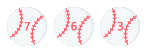

    

# 프리코스 2주차 미션 - 숫자 야구

> 1부터 9까지 서로 다른 수로 이루어진 3자리의 수를 맞추는 게임입니다.

게임 gif 넣기
 

## 목차
- [게임 방법](#게임-방법)
- [주의 사항](#주의-사항)
- [기능 목록](#기능-목록)
 

## 게임 방법
컴퓨터는 <i>**1에서 9까지 서로 다른 임의의 수 3개**</i>를 선택합니다. 사용자는 컴퓨터가 생각하고 있는 서로 다른 3개의 숫자를 입력합니다. 컴퓨터는 자신의 숫자를 입력받은 숫자와 비교합니다. 같은 수가 같은 자리에 있으면 **스트라이크**, 다른 자리에 있으면 **볼**, 같은 수가 전혀 없으면 **낫싱**이란 힌트를 제시하며, 힌트를 이용해서 컴퓨터의 수를 맞히면 승리합니다!🎉 해당 게임이 끝나면 게임을 다시 시작하거나 완전히 종료할 수 있습니다.

예) 컴퓨터의 수가 425일 때
- 123을 입력한 경우 : 1스트라이크
- 456을 입력한 경우 : 1볼 1스트라이크
- 789를 입력한 경우 : 낫싱
 

## 🚨주의 사항🚨
입력된 값이 <i>**1에서 9 사이의 숫자가 아닌 경우**</i> (0, 문자, 특수기호 등 포함) 게임이 강제 종료됩니다!
 
 

## 기능 목록
클래스 `Application`에서 게임이 실행됩니다. 다음의 내용들은 게임 실행에 필요한 기능들입니다.
### 🗂 players
<table>
    <colgroup> 
        <col width="10%"/> 
        <col width="40%"/> 
        <col width="50%"/>
    </colgroup>
    <th>클래스</th>
    <th>메서드</th>
    <th>설명</th>
    <tr>
        <td><b>Computer</b></td>
        <td><code>createThreeDifferentNumbers</code></td>
        <td>메서드 설명 메서드 설명 메서드 설명 메서드 설명 메서드 설명</td>
    </tr>
    <tr>
        <td rowspan="2"><b>User</b></td>
        <td><code>createThreeDifferentNumbers</code></td>
        <td>메서드 설명 메서드 설명 메서드 설명 메서드 설명 메서드 설명</td>
    </tr>
    <tr>
        <td><code>splitToDigits</code></td>
        <td>메서드 설명 메서드 설명 메서드 설명 메서드 설명 메서드 설명
    </td>
    </tr>
</table>

### 🗂 settings
<table>
<th>클래스</th>
<th>메서드</th>
<th>설명</th>
<tr>
<td><b>Calculation</b></td>
<td><code>getScoresBy</code></td>
<td>메서드 설명 메서드 설명 메서드 설명 메서드 설명 메서드 설명</td>
</tr>
<tr>
<td><b>Constants</b></td>
<td></td>
<td>메서드 실행에 필요한 원시값들이 포장되어 있습니다.</td>
</tr>
<tr>
<td rowspan="4"><b>Logic</b></td>
<td><code>gameStart</code></td>
<td>메서드 설명 메서드 설명 메서드 설명 메서드 설명 메서드 설명</td>
</tr>
<tr>
<td><code>checkThreeStrikes</code></td>
<td>메서드 설명 메서드 설명 메서드 설명 메서드 설명 메서드 설명</td>
</tr>
<tr>
<td><code>gameShouldContinue</code></td>
<td>메서드 설명 메서드 설명 메서드 설명 메서드 설명 메서드 설명</td>
</tr>
<tr>
<td><code>checkResponseCode</code></td>
<td>메서드 설명 메서드 설명 메서드 설명 메서드 설명 메서드 설명</td>
</tr>
<tr>
<td rowspan="5"><b>ResultView</b></td>
<td><code>printOut</code></td>
<td>메서드 설명 메서드 설명 메서드 설명 메서드 설명 메서드 설명</td>
</tr>
<tr>
<td><code>getBallMessage</code></td>
<td>메서드 설명 메서드 설명 메서드 설명 메서드 설명 메서드 설명</td>
</tr>
<tr>
<td><code>getSpace</code></td>
<td>메서드 설명 메서드 설명 메서드 설명 메서드 설명 메서드 설명</td>
</tr>
<tr>
<td><code>getStrikeMessage</code></td>
<td>메서드 설명 메서드 설명 메서드 설명 메서드 설명 메서드 설명</td>
</tr>
<tr>
<td><code>getNothingMessage</code></td>
<td>메서드 설명 메서드 설명 메서드 설명 메서드 설명 메서드 설명</td>
</tr>
<tr>
<td rowspan="3"><b>Validator</b></td>
<td><code>check</code></td>
<td>메서드 설명 메서드 설명 메서드 설명 메서드 설명 메서드 설명</td>
</tr>
<tr>
<td><code>isThreeNumbers</code></td>
<td>메서드 설명 메서드 설명 메서드 설명 메서드 설명 메서드 설명</td>
</tr>
<tr>
<td><code>isAllDifferent</code></td>
<td>메서드 설명 메서드 설명 메서드 설명 메서드 설명 메서드 설명
</td>
</tr>
</table>
 

---
## 이미지 출처
<a href="https://www.flaticon.com/free-icons/fastball" title="fastball icons">Fastball icons created by Freepik - Flaticon</a>
