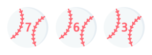

    

# 프리코스 2주차 미션 - 숫자 야구

> 서로 다른 세 자리 수로 이루어진 숫자를 맞히는 게임입니다.

게임 gif 넣기
 

## 목차
- [게임 방법](#게임-방법)
- [주의 사항](#주의-사항)
- [기능 목록](#기능-목록)
 

## 게임 방법
컴퓨터는 <i><b>1에서 9까지 서로 다른 임의의 수 3개</b></i>를 선택합니다. 사용자는 컴퓨터가 생각하고 있는 숫자를 입력합니다. 컴퓨터는 자신의 숫자를 사용자가 입력한 숫자와 비교합니다. 같은 수가 같은 자리에 있으면 <i><b>스트라이크</b></i>, 다른 자리에 있으면 <i><b>볼</b></i>, 같은 수가 전혀 없으면 <i><b>낫싱</b></i>이란 힌트가 제공되며, 사용자는 힌트를 이용해 컴퓨터의 숫자를 맞히면 승리합니다!🎉 해당 게임이 끝나면 게임을 다시 시작하거나 종료할 수 있습니다.

예) 컴퓨터의 숫자가 425일 때
- 123을 입력한 경우 : 1스트라이크
- 456을 입력한 경우 : 1볼 1스트라이크
- 789를 입력한 경우 : 낫싱
 

## 🚨주의 사항🚨
진행 과정에서 잘못된 값을 입력하면 게임이 강제 종료됩니다!
- 1과 9 사이로 이루어진 세 자리 숫자가 아닌 경우 <i><b>(1234, 019, 7a2, !@2, ㅎ2염, 공백)</b></i>
- 숫자가 서로 다른 수로 이루어져 있지 않은 경우 <i><b>(288, 311, 777)</b></i>
- 컴퓨터의 숫자를 맞힌 후 게임 재개 여부를 묻는 메시지에 <i><b>1과 2 이외의 값</b></i>을 입력하는 경우
 

## 기능 목록
클래스 **Application**에서 게임이 실행됩니다. 다음의 내용은 게임 실행에 필요한 기능들입니다. 패키지 안의 클래스들은 알파벳 순서로, 각 메서드는 구현 순서로 정렬되어 있습니다.
### 🗂 players
<table>
    <th>클래스</th>
    <th>메서드</th>
    <th>설명</th>
    <tr>
        <td rowspan="2"><b>Computer</b></td>
        <td><code>createThreeDigitNumber</code></td>
        <td>로컬 변수 <i><b>digits</b></i>를 생성 후 반환합니다. <i><b>digits</b></i>엔 1에서 9사이의 서로 다른 세 자리 수가 담길 예정입니다.</td>
    </tr>
    <tr>
        <td><code>addNewDigit</code></td>
        <td>1과 9사이의 수를 하나 골라 <i><b>digits</b></i>에 추가합니다.</td>
    </tr>
    <tr>
        <td rowspan="2"><b>User</b></td>
        <td><code>createThreeDigitNumber</code></td>
        <td>로컬 변수 <i><b>digits</b></i>를 생성 후 반환합니다. <i><b>digits</b></i>엔 사용자의 입력값을 나타내는 변수 <i><b>enteredNumber</b></i>가 담길 예정입니다.</td>
    </tr>
    <tr>
        <td><code>splitToDigits</code></td>
        <td><i><b>enteredNumber</b></i>를 받아 각 자릿수로 분리하고 <i><b>digits</b></i>에 추가합니다.</td>
    </tr>
</table>

### 🗂 settings
<table>
    <th>클래스</th>
    <th>메서드</th>
    <th>설명</th>
    <tr>
        <td><b>Calculator</b></td>
        <td><code>getScoresByNumbers</code></td>
        <td>컴퓨터 숫자와 사용자 숫자를 받고, 둘을 비교해 볼과 스트라이크의 개수를 구합니다.</td>
    </tr>
    <tr>
        <td><b>Constants</b></td>
        <td></td>
        <td>메서드 실행에 필요한 원시값들이 포장되어 있습니다.</td>
    </tr>
    <tr>
        <td rowspan="4"><b>Controller</b></td>
        <td><code>start</code></td>
        <td>실제 게임이 진행되는 곳이며, 게임이 끝났을 때 재개 및 종료 여부를 확인합니다.</td>
    </tr>
    <tr>
        <td><code>checkIfThreeStrikes</code></td>
        <td>사용자가 컴퓨터의 숫자를 맞혔는지 (3스트라이크) 확인합니다.</td>
    </tr>
    <tr>
        <td><code>shouldContinue</code></td>
        <td>사용자가 컴퓨터의 숫자를 맞혔을 경우 사용자에게 게임을 다시 시작할지 종료할지 물어봅니다. 사용자의 응답은 변수 <i><b>userResponse</b></i>에 할당됩니다.</td>
    </tr>
    <tr>
        <td><code>checkResponseCode</code></td>
        <td><i><b>userResponse</b></i>를 받아와 게임 재개 및 종료를 결정합니다.</td>
    </tr>
    <tr>
        <td rowspan="5"><b>ResultViewer</b></td>
        <td><code>printOut</code></td>
        <td>클래스 <b>Calculator</b>에서 구한 볼과 스트라이크 개수를 출력합니다.</td>
    </tr>
    <tr>
        <td><code>getBallMessage</code></td>
        <td>볼의 개수를 출력합니다. ("1볼")</td>
    </tr>
    <tr>
        <td><code>getSpace</code></td>
        <td>볼과 스트라이크 사이의 띄어쓰기를 출력합니다. (1볼" "1스트라이크)</td>
    </tr>
    <tr>
        <td><code>getStrikeMessage</code></td>
        <td>스트라이크 개수를 출력합니다. ("1스트라이크")</td>
    </tr>
    <tr>
        <td><code>getNothingMessage</code></td>
        <td>"낫싱"을 출력합니다. 볼과 스트라이크의 개수가 모두 0일 때 출력됩니다.</td>
    </tr>
    <tr>
        <td rowspan="3"><b>Validator</b></td>
        <td><code>check</code></td>
        <td>사용자의 입력값이 <code>hasThreeDigits</code>와 <code>hasDifferentDigits</code>를 만족하는지 검사합니다. 유효한 값이 아닌 경우 <code>IllegalArgumentException</code>을 발생시켜 게임을 종료합니다.</td>
    </tr>
    <tr>
        <td><code>hasThreeDigits</code></td>
        <td>사용자의 입력값이 1과 9사이의 세 자리 수로 이루어진 숫자인지 검사해 boolean을 반환합니다.</td>
    </tr>
    <tr>
        <td><code>hasDifferentDigits</code></td>
        <td>사용자의 입력값이 서로 다른 수로 이루어졌는지 검사해 boolean을 반환합니다.</td>
    </tr>
</table>
 

---
## 이미지 출처
<a href="https://www.flaticon.com/free-icons/fastball" title="fastball icons">Fastball icons created by Freepik - Flaticon</a>
