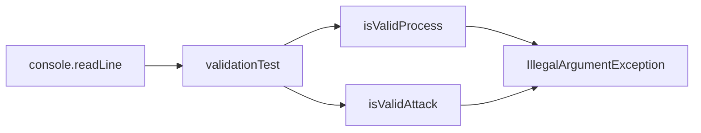
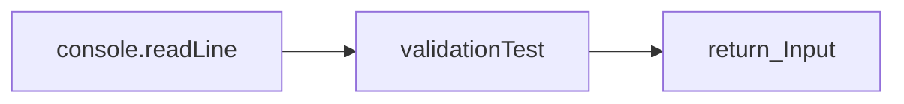
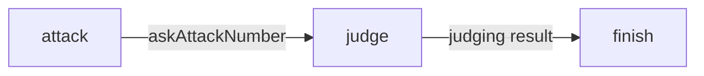
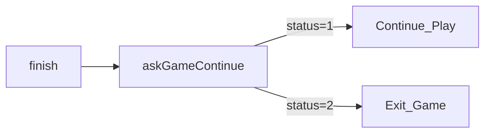

# Util

## InputUtility

사용자 입력과 관련된 모든 행위를 실행하는 유틸클래스

### readLine

사용자 입력을 받은뒤 입력이 유효한지 검사하는 메소드

- 입력이 유효하지 않는 경우

- 입력이 유효한 경우

### parsingNumber

문자열을 정수형 리스트로 Parsing하여 리스트 객체를 반환하는 메소드

## GameCode

게임의 진행을 위한 Code를 미리 정의해둔 Enum Class

| Code Name | Value | 설명 |
| --- | --- | --- |
| PLAY | 1 | 게임이 실행되고 있음 |
| EXIT | 2 | 게임의 종료를 원함 |
| ATTACK | 3 | 공격을 입력받기 위한 code |
| CONTINUE | 4 | 게임을 지속적으로 진행할지 여부를 입력받는 code |

# Model

## Baseball

숫자 야구의 원시값인 숫자을 포장하고 있는 Class

### Baseball

Baseball 객체를 생성하는 생성자. 오버로딩을 통해서 매개변수가 없다면 랜덤한 값의 Baseball을, 매개변수로 정수형 하나가 들어온다면 해당 값을 가지는 Baseball객체를 생성한다.

### baseballEqual

두개의 Baseball 객체를 입력받아서 값을 비교, 두개의 값이 같다면 true를  return한다.

### baseballContain

Baseball 객체의 List와 한개의 Baseball 객체를 입력받아 Listk안에 같은 값의 Baseball이 있는지 확인한다. 있다면 true를 return한다.

## Player

### defend

랜덤하게 숫자를 가지는 Baseball List를 생성, 리턴하는 함수

### attack

입력받은 정수형 리스트를 Baseball List로 변환하여 리턴하는 함수

## Judge

게임에 대한 기록을 가지고 있는 클래스.

### judge

attack과 defend를 비교하여 결과를 문자열로 반환하는 함수

### setAttack

attack을 기록하는 함수

### setDefend

defend를 기록하는 함수

## Game

전체적인 게임을 주관하는 클래스

### start

Game 객체를 생성하고 Game객체를 리턴한다.

### play

게임을 진행하는 메소드. 1턴이 진행될때마다 아래와 같은 절차를 거친다.

finish함수가 호출되면 아래와 같은 프로세스를 통해서 게임 진행여부를 결정한다.

