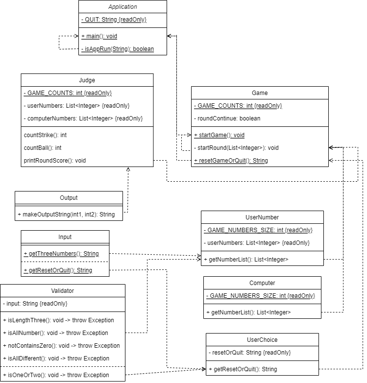

## 📊 최종 리팩터링 코드 UML Class Diagram

---

# 📃 구현할 기능 목록

## Computer 클래스
1. 1에서 9까지 서로 다른 임의의 수 3개를 선택해 List<Integer>에 저장한다.
    - 1에서 9까지 범위에서 random int를 구하는 기능
    - 무작위 수를 List에 저장하는 기능
    - 새로 뽑힌 수와 이미 저장된 수를 비교하는 기능
    - 서로 다른 3개의 수가 모두 List에 저장되었을 때 반복을 종료하는 기능

## User 클래스
### 게임 진행시 입력 받는 부분
1. 사용자 입력을 받는다.
    - 사용자 입력을 받는 콘솔 텍스트를 띄우는 기능
     (ex. 숫자를 입력해주세요 : )
2. 사용자 입력이 올바른 입력인지 확인한다.
    - (Validator 클래스 메소드 활용)
3. 올바른 입력에 대해 숫자를 List<Integer>에 저장한다.
    - 입력값을 파싱하여 Integer type 변환을 하는 기능
    - int 값을 List<Integer>에 저장하는 기능
### 게임 종료시 입력 받는 부분
4. 사용자 입력을 받는다.
   - 사용자 입력을 받는 콘솔 텍스트를 띄우는 기능
     (ex. 게임을 새로 시작하려면 1, 종료하려면 2를 입력하세요.)
5. 사용자 입력값이 올바른지 확인한다.
   - Validator 클래스 4번 기능을 실행한다.

## Judge 클래스
1. 사용자 입력 List와 컴퓨터 List의 각 인덱스를 비교해 같은 값의 원소의 개수를 찾는다.
    - 같은 원소의 개수 = 스트라이크 수
3. 서로 다른 인덱스를 비교해 인덱스가 다르지만 값은 같은 원소의 개수를 찾는다.
    - 인덱스 다르지만 값은 같은 원소의 개수 = 볼 수
4. 결과값을 출력한다.
   - ex.1볼 1스트라이크

## Validator 클래스
### 게임 중 Input값 확인
1. 문자열에 숫자가 아닌 값이 있는지 확인한다.
2. 문자열에 3개의 숫자만 포함되어 있는지 확인한다.
3. 문자열에 있는 3개의 숫자가 모두 다른 값인지 확인한다.
    - 아닐 경우 모두 `IllegalArgumentException`를 발생
### 게임 종료 후 Input값 확인
4. 문자열이 '1' 또는 '2'인지 확인한다.
    - 아닐 경우 모두 `IllegalArgumentException`를 발생

## Game 클래스
### 1. 게임을 시작하는 기능
1. Computer 클래스에서 1번 기능을 실행한다
2. User 클래스에 1-3번 기능을 실행한다.
3. 사용자 입력 List와 Computer 인스턴스가 생성한 List를 비교하여 결과 값을 출력한다.
   - Judge 클래스 1-4번 기능을 실행한다.
### 2. 게임을 다시 시작할지 종료할지 선택하는 기능 
4. 게임을 반복할지 계속 진행할지 알려준다.
    - Game 클래스에 gameOver 맴버 필드 추가
      - 초기값 false 설정
    - 스트라이크 수가 3이면 gameOver 값 true 변경
    - while문, gameOver 변수가 false이면 계속 반복하다가 true가 될 경우 게임 반복 종료
5. 게임 재시작/ 게임 종료 여부 선택지를 출력한다.
    - (ex. 게임을 새로 시작하려면 1, 종료하려면 2를 입력하세요.)

## Application 클래스
1. 게임의 시작을 출력한다
   (ex. 숫자 야구 게임을 시작합니다.)
2. Game 클래스의 1. 게임을 시작하는 기능을 실행한다
3. Game 클래스의 2. 게임을 다시 시작할지 종료할지 선택하는 기능을 실행한다.
   - 게임 다시 시작이 선택되면 2로 다시 돌아가 게임을 실행한다.
   - 게임이 종료되면 반복문에서 나가 게임을 종료한다.