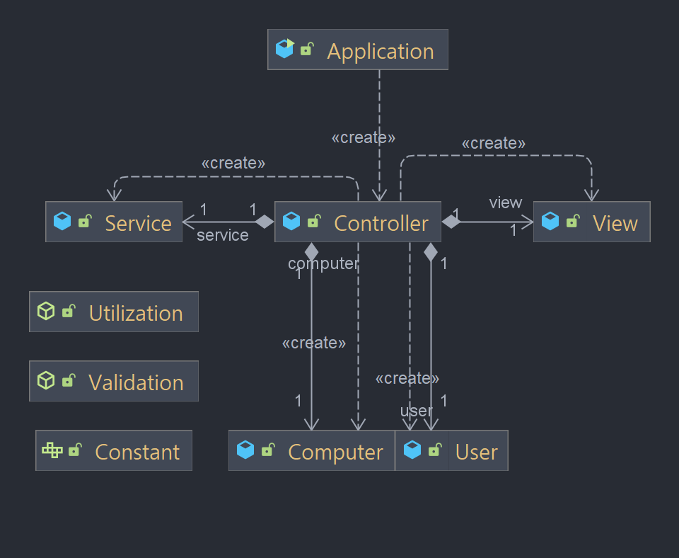

# 🔍 구현 기능 목록

## ✅ 컴퓨터 숫자 생성

- 1이상 9이하의 정수를 랜덤하게 3회 산출

## ☑️ 컴퓨터 숫자 중복 검사

- 산출된 정수들에 중복값이 존재하는지 확인

## ✅ 게임 시작

- `숫자 야구 게임을 시작합니다.` 문구 출력

## ✅ 유저 숫자 입력

- 유저로부터 3개의 정수 입력 받기

## ☑️ 유저 입력 검사

- 입력 문자열의 길이가 3인지 확인
- 입력 문자열이 모두 1이상 9이하의 정수인지 확인
- 입력 문자열에 중복된 문자가 존재하는지 확인
- 게임이 끝난 경우 입력 문자열이 “1” 또는 “2”인지 확인

## ✅ 힌트 계산

- 볼 개수 계산
- 스트라이크 개수 계산
- 낫싱 계산

## ✅ 게임 수행

- `숫자를 입력해주세요 :` 문구 출력
- 힌트 출력
- 3스트라이크 일 경우 `3개의 숫자를 모두 맞히셨습니다! 게임 종료
  게임을 새로 시작하려면 1, 종료하려면 2를 입력하세요.` 문구 출력 후 게임 종료

## ✅ 게임 종료

- 재시작 여부 메시지 출력
- 유저로부터 재시작(”1”) 또는 종료(”2”) 입력 받기
- 게임 재시작/종료하기

# 📖 프로젝트 구조

- domain
  - `Computer` : 컴퓨터 숫자를 생성 및 저장한다.
  - `User` : 유저 숫자 및 재시작/종료값을 입력받고 저장한다.
- game
  - `Controller` : Service, View를 다루며 게임의 흐름을 담당한다.
  - `Service` : 힌트 계산 및 힌트의 문자열 변환 로직을 담당한다.
  - `View` : 입력 및 출력을 담당한다.
- util
  - `Constant` : 프로그램 내 모든 상수들을 정의한다.
  - `Utilization` : 랜덤 숫자 생성 로직, 자료구조 변환 등 기능적 메소드들을 담는다.
  - `Validation` : 숫자 중복, 유저 입력 등을 검증한다.



# 📓 구현 로직

```
1. 게임 시작 문구 출력
2. 컴퓨터 숫자 생성
3. 컴퓨터 숫자 중복 검사
4. 게임 수행
	4-1. "숫자를 입력해주세요 : " 문구 출력
	4-2. 유저 숫자 입력
	4-3. 유저 입력 검사
		4-3-1. 입력 문자열의 길이가 3인지 확인
		4-3-2. 입력 문자열이 모두 1이상 9이하인지 확인
		4-3-3. 입력 문자열에 중복이 존재하는지 확인
	4-4. 힌트 계산
		4-4-1. 스트라이크/볼/낫싱 계산
	4-5. 힌트 계산 결과 출력
		4-5-1. 3스트라이크일 경우 문구 출력 후 [5]로 이동
		4-5-2. 그렇지 않을 경우 힌트 출력 후 [4]로 이동
5. 게임 종료
	5-1. 재시작 여부 메시지 출력
	5-2. 유저 숫자(1 또는 2) 입력
		5-2-1. 재시작일 경우 [2]로 이동
		5-2-2. 종료일 경우 게임 최종 종료
```