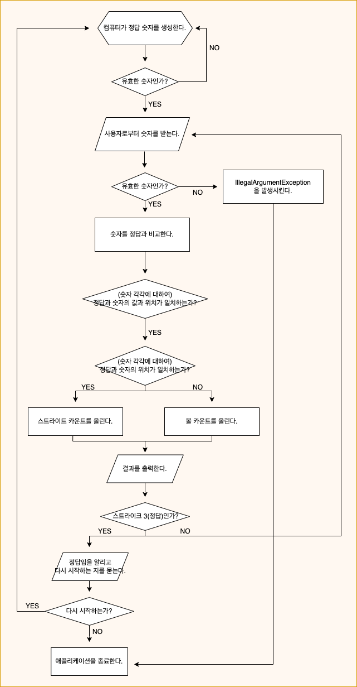
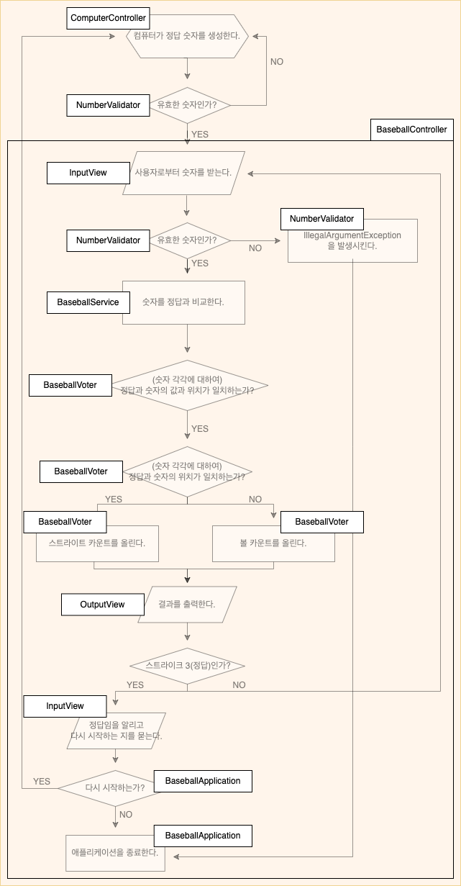

## 🗺 설계
* [x] 애플리케이션 흐름 구상하기

* [x] 애플리케이션 실행 과정에서 필요한 객체 구상하기

## 🛠 기능 구현

### 컴퓨터가 정답 숫자를 생성한다.
* [x] 구현 완료
  * [x] 서로 다른 임의의 수 3개를 만든다.
  * [x] 애플리케이션 전체에서 접근할 수 있는 홀더에 저장한다. (동시성 이슈 고려 필요)

### 유효한 숫자인가?
* [x] 구현 완료
  * [x] 컴퓨터로 만든 숫자가 유효한 값인 지 검증한다.
  * [x] 사용자가 만든 숫자가 유효한 값인 지 검증한다.
    * [x] 검증 내용 - 입력한 숫자가 1에서 9 사이의 정수인가?
    * [x] 검증 내용 - 3개의 숫자만 입력했는가?
    * [x] 검증 내용 - 입력한 숫자가 서로 다른 수인가?

### IllegalArgumentException을 발생시킨다.
* [x] 구현 완료
  * [x] 사용자 입력값의 경우 예외가 발생하면 잡지 않고 애플리케이션을 종료한다.
  * [x] 컴퓨터가 만든 값의 경우 예외가 발생하면 숫자를 다시 만든다.

### 사용자로부터 숫자를 받는다.
* [x] 구현 완료
  * [x] 사용자로부터 숫자를 입력하도록 유도하는 메시지를 출력한다.
  * [x] 사용자로부터 숫자를 입력받는다.
  * [x] 사용자로부터 받은 String 값을 List<Integer> 로 변환한다.

### 숫자를 정답과 비교한다.
* [ ] 구현 완료
  * [x] 정답과 숫자의 값과 위치가 일치하는가?
  * [x] 스트라이크 카운트를 올린다.
  * [x] 정답과 숫자의 위치가 일치하는가?
  * [x] 볼 카운트를 올린다.

### 결과를 출력한다.
* [ ] 구현 완료
  * [x] 결과에 따라 알맞는 메시지를 만든다.

### 스트라이크 3(정답)인가?
* [ ] 구현 완료

### 정답임을 알리고 다시 시작하는 지를 묻는다.
* [ ] 구현 완료

### 다시 시작하는가?
* [ ] 구현 완료
