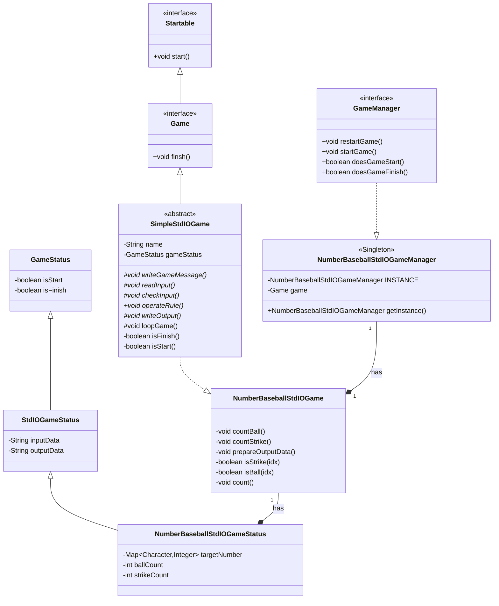

# 미션 - 숫자야구

---

## 🎯목표

숫자 야구 게임을 개발한다. 숫자 야구 게임이란, 기본적으로 1부터 9까지 서로 다른 수로 이루어진 3자리의 수를 맞추는 게임이다.

## 🚀 기능 요구 사항

기본적으로 1부터 9까지 서로 다른 수로 이루어진 3자리의 수를 맞추는 게임이다.

- 같은 수가 같은 자리에 있으면 스트라이크, 다른 자리에 있으면 볼, 같은 수가 전혀 없으면 낫싱이란 힌트를 얻고, 그 힌트를 이용해서 먼저 상대방(컴퓨터)의 수를 맞추면 승리한다.
    - 예) 상대방(컴퓨터)의 수가 425일 때
        - 123을 제시한 경우 : 1스트라이크
        - 456을 제시한 경우 : 1볼 1스트라이크
        - 789를 제시한 경우 : 낫싱
- 위 숫자 야구 게임에서 상대방의 역할을 컴퓨터가 한다. 컴퓨터는 1에서 9까지 서로 다른 임의의 수 3개를 선택한다. 게임 플레이어는 컴퓨터가 생각하고 있는 서로 다른 3개의 숫자를 입력하고, 컴퓨터는 입력한 숫자에 대한
  결과를 출력한다.
- 이 같은 과정을 반복해 컴퓨터가 선택한 3개의 숫자를 모두 맞히면 게임이 종료된다.
- 게임을 종료한 후 게임을 다시 시작하거나 완전히 종료할 수 있다.
- 사용자가 잘못된 값을 입력할 경우 `IllegalArgumentException`을 발생시킨 후 애플리케이션은 종료되어야 한다.

### 입출력 요구 사항

#### 입력

- 서로 다른 3자리의 수
- 게임이 끝난 경우 재시작/종료를 구분하는 1과 2 중 하나의 수

#### 출력

- 입력한 수에 대한 결과를 볼, 스트라이크 개수로 표시

```
1볼 1스트라이크
```

- 하나도 없는 경우

```
낫싱
```

- 3개의 숫자를 모두 맞힐 경우

```
3스트라이크
3개의 숫자를 모두 맞히셨습니다! 게임 종료
```

- 게임 시작 문구 출력

```
숫자 야구 게임을 시작합니다.
``` 

#### 실행 결과 예시

```
숫자 야구 게임을 시작합니다.
숫자를 입력해주세요 : 123
1볼 1스트라이크
숫자를 입력해주세요 : 145
1볼
숫자를 입력해주세요 : 671
2볼
숫자를 입력해주세요 : 216
1스트라이크
숫자를 입력해주세요 : 713
3스트라이크
3개의 숫자를 모두 맞히셨습니다! 게임 종료
게임을 새로 시작하려면 1, 종료하려면 2를 입력하세요.
1
숫자를 입력해주세요 : 123
1볼
...
```

---

## 🎯 프로그래밍 요구 사항

- JDK 11 버전에서 실행 가능해야 한다. **JDK 11에서 정상적으로 동작하지 않을 경우 0점 처리한다.**
- 프로그램 실행의 시작점은 `Application`의 `main()`이다.
- `build.gradle` 파일을 변경할 수 없고, 외부 라이브러리를 사용하지 않는다.
- [Java 코드 컨벤션](https://github.com/woowacourse/woowacourse-docs/tree/master/styleguide/java) 가이드를 준수하며 프로그래밍한다.
- 프로그램 종료 시 `System.exit()`를 호출하지 않는다.
- 프로그램 구현이 완료되면 `ApplicationTest`의 모든 테스트가 성공해야 한다. **테스트가 실패할 경우 0점 처리한다.**
- 프로그래밍 요구 사항에서 달리 명시하지 않는 한 파일, 패키지 이름을 수정하거나 이동하지 않는다.

### 추가된 요구 사항

- indent(인덴트, 들여쓰기) depth를 3이 넘지 않도록 구현한다. 2까지만 허용한다.
    - 예를 들어 while문 안에 if문이 있으면 들여쓰기는 2이다.
    - 힌트: indent(인덴트, 들여쓰기) depth를 줄이는 좋은 방법은 함수(또는 메서드)를 분리하면 된다.
- 3항 연산자를 쓰지 않는다.
- 함수(또는 메서드)가 한 가지 일만 하도록 최대한 작게 만들어라.
- JUnit 5와 AssertJ를 이용하여 본인이 정리한 기능 목록이 정상 동작함을 테스트 코드로 확인한다.
    - 테스트 도구 사용법이 익숙하지 않다면 `test/java/study`를 참고하여 학습한 후 테스트를 구현한다.

### 라이브러리

- `camp.nextstep.edu.missionutils`에서 제공하는 `Randoms` 및 `Console` API를 사용하여 구현해야 한다.
    - Random 값 추출은 `camp.nextstep.edu.missionutils.Randoms`의 `pickNumberInRange()`를 활용한다.
    - 사용자가 입력하는 값은 `camp.nextstep.edu.missionutils.Console`의 `readLine()`을 활용한다.

#### 사용 예시

```java
List<Integer> computer = new ArrayList<>();
while (computer.size() < 3) {
    int randomNumber = Randoms.pickNumberInRange(1, 9);
    if (!computer.contains(randomNumber)) {
        computer.add(randomNumber);
    }
}
```

---

## ✏️ 과제 진행 요구 사항

- 미션은 [java-baseball](https://github.com/woowacourse-precourse/java-baseball) 저장소를 Fork & Clone해 시작한다.
- **기능을 구현하기 전 `docs/README.md`에 구현할 기능 목록을 정리**해 추가한다.
- **Git의 커밋 단위는 앞 단계에서 `docs/README.md`에 정리한 기능 목록 단위**로 추가한다.
    - [커밋 메시지 컨벤션](https://gist.github.com/stephenparish/9941e89d80e2bc58a153) 가이드를 참고해 커밋 메시지를 작성한다.
- 과제 진행 및 제출 방법은 [프리코스 과제 제출](https://github.com/woowacourse/woowacourse-docs/tree/master/precourse) 문서를 참고한다.

---

## 👀요구사항 분석

- 프로그램은 시작하며 `"숫자 야구를 시작합니다.\n"`를 출력한다.
- 프로그램은 사용자의 입력을 기다린다.
- 사용자는 서로 다른 1~9 사이의 숫자 3자를 입력한다.
  - 서로 다른 1~9 사이의 숫자 3자가 아닌 입력은 잘못된 값이다.
  - ex) `"121"`, `"1 23"`, `"!23"`, `"#$^"`, `"1234"`, `"102"`, `"015"` 등
- 프로그램은 사용자가 잘못된 값을 입력할 경우 `IllegalArgumentException`을 발생시킨 후 종료된다.
- 프로그램은 서로 다른 임의의 숫자 3자를 지닌다.
- 사용자의 입력은 사용자가 입력한 숫자 3자가 프로그램이 지닌 숫자 3자와 동일할 때까지 반복한다.
- 프로그램은 지닌 숫자 3자와 사용자의 입력 숫자 3자를 비교한다.
- 프로그램은 `볼`과 `스트라이크`을 센다.
- `볼`은 사용자가 입력한 숫자 중 프로그램이 지닌 숫자와 종류가 같으나 위치가 다른 숫자의 개수이다.
- `스트라이크`는 사용자가 입력한 숫자 중 프로그램이 지닌 숫자와 종류가 같고 위치도 같은 숫자의 개수이다.
- 프로그램은 사용자 입력 후에 `볼`과 `스트라이크`을 출력한다.
  - 출력시에 `"<볼>볼 <스트라이크>스트라이크"` 형식으로 출력한다.
- 프로그램은 `볼`과 `스트라이크` 모두 0 이면 `"낫싱"`을 출력한다.
- 프로그램은 사용자의 입력과 지닌 숫자 3자가 동일할 경우, `"3개의 숫자를 모두 맞히셨습니다! 게임 종료\n"`를 출력한다.
- 프로그램은 게임이 종료 전 `"게임을 새로 시작하려면 1, 종료하려면 2를 입력하세요."`를 출력하고 사용자 입력을 기다린다.
  - 프로그램은 사용자 입력이 1일 때, 게임을 새로 시작한다.
  - 프로그램은 사용자 입력이 0일 때, 게임을 종료한다.

---

## 📜객체 설계

### 📝클래스 다이어그램



#### Startable

시작 할 수 있음을 표현한 간단한 **인터페이스**

- 시작할수 있다.
  - `void start()`

#### Game

게임을 표현한 **인터페이스**이다. `Startable`을 상속한다.
- 게임을 끝낸다.
  - `void finish()`

#### SimpleStdIOGame

표준 입출력을 이용한 간단한 게임을 표현한 **추상 클래스**이다. `Game`을 상속한다.

- 게임의 이름을 지닌다.
  - `private String name`
- 게임의 상태를 지닌다.
  - `private GameStatus gameStatus`
- 게임 상태에 따라 메시지를 출력한다.
  - `protected abstract void writeGameMessage()`
- 입력을 받는다.
  - `protected abstract void readInput()`
- 입력에 오류를 점검한다.
  - `protected abstract void checkInput() throws IllegalArgumentException`
- 입력을 게임의 규칙에 따라 판단한다.
  - `public abstract void operateRule()`
    - 판단에 따라 게임의 상태가 변한다.
- 판단에 따라 출력을 낸다.
  - `protected abstract void writeOutput()`
- 게임의 로직을 반복한다.
  - `protected void loopGame()`
  ```java
  protected void loopGame() {
    writeGameMessage();
    while (!isFinish()) {
        readInput();
        checkInput();
        operateRule();
        writeOutput();
    }
    writeGameMessage();
  }
  ```
- 게임이 끝났는지 검사한다.
  - `private boolean isFinish()`
- 게임이 시작했는지 검사한다.
  - `private boolean isStart()`

#### NumberBaseballStdIOGame

표준 입출력을 이용한 숫자야구 게임을 표현한 **클래스**이다. `SimpleStdIOGame`을 상속한다.
- `볼`을 계산한다.
  - `private void countBall()`
- `스트라이크`를 계산한다.
  - `private void countStrike()`
- 현재 상태를 보고 출력문을 작성한다.
  - `private void prepareOutputData()`
- 사용자 입력의 인덱스와 프로그램이 지닌 숫자의 인덱스를 비교한다.
  - `private boolean isStrike(int idx)`
  - `private boolean isBall(int idx)`
- `볼`과 `스트라이크`를 계산한다.
  - `private void count()`

#### GameStatus

게임의 상태를 나타내는 **클래스**이다.
- 게임의 상태 값을 갖는다.
  - `private boolean isStart`
  - `private boolean isFinish`

#### StdIOGameStatus

표준 입출력을 이용한 게임의 상태를 나타내는 **클래스**이다. `GameStatus`를 상속한다.
- 입력 데이터를 갖는다.
  - `private String inputData`
- 출력 데이터를 갖는다.
  - `private String outputData`

#### NumberBaseballStdIOGameStatus

표준 입출력을 이용한 숫자야구 게임의 상태를 나타내는 **클래스**이다. `StdIOGameStatus`를 상속한다.
- 사용자가 맞춰야하는 숫자 3자를 갖는다.
  - `private Map<char,int> targetNumber`
- `볼`을 담을 데이터를 갖는다.
  - `private Integer ballCount`
- `스트라이크`를 담을 데이터를 갖는다.
  - `private Integer strikeCount`

#### GameManager

게임의 시작과 종료를 관리하는 **인터페이스**이다.
- 게임을 재시작한다.
  - `public void restartGame()`
- 게임을 시작한다.
  - `public void startGame()`

#### NumberBaseballStdIOGameManager

표준 입출력을 이용한 숫자 야구 게임의 시작과 종료를 관리하는 **클래스**이다. `GameManager`를 구현한다.
- 프로그램 상에 하나의 객체만 존재한다.
- 표준 입출력을 이용한 숫자 야구 게임을 갖는다.
  - `private final Game game`
- 게임이 끝난 상태인지 검사한다.
  - `public boolean doesGameFinish()`
- 게임이 시작한 상태인지 검사한다.
  - `public boolean doesGameStart()`