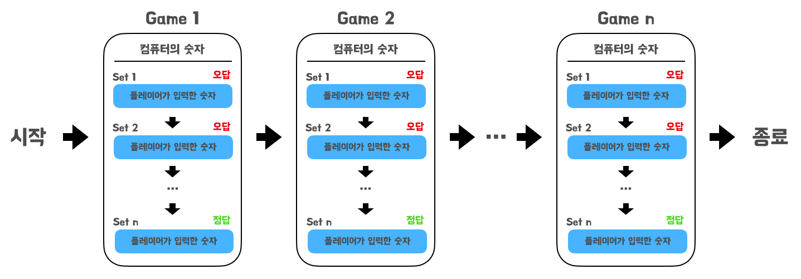

## 🎯 구현할 기능 목록

<details>
   <summary>게임 진행순서</summary>
   <div markdown="1">

1. 컴퓨터(상대방)가 1 ~ 9 중 임의의 숫자 3개를 선택한다. (서로 다른 숫자)
    - 게임 시작 문구 출력
    ```
    숫자 야구 게임을 시작합니다.
    ```
2. 플레이어가 숫자를 입력한다.
   ```
   숫자를 입력해주세요 : '입력한 숫자'
   ```
    - 숫자를 맞출 때까지 진행
    - 플레이어가 숫자를 입력 ex) `123`
    - 컴퓨터는 해당 숫자에 대한 결과를 출력
        - 오답일 경우
          ```
          O볼 O스트라이크
          ```
        - 하나도 없는 경우
          ```
          낫싱
          ```
        - 3개다 맞힐 경우
          ```
          3스트라이크
          3개의 숫자를 모두 맞히셨습니다! 게임 종료
          ```
        - 잘못된 값을 입력한 경우(숫자가 아닌 값)
            - `IllegalArgumentException`을 발생시킨 후 애플리케이션은 종료

    <br>

3. 게임 종료 후 한번 더 플레이할지 여부 결정
    ```
    게임을 새로 시작하려면 1, 종료하려면 2를 입력하세요.
    ```
    - `1` 입력시 2️⃣ 단계부터 다시 시작
    - `2` 입력시 게임 종료
    - - 잘못된 값을 입력한 경우(숫자가 아닌 값)
        - `IllegalArgumentException`을 발생시킨 후 애플리케이션은 종료

    <br>
   </div>

</details>

<div align="center">
    
</div>

<br>

게임은 컴퓨터의 숫자를 생성해서 플레이어가 맞추는 시도를 하는 것을 한 사이클로 보고 `Game` 으로 간주한다.  
그리고 그 사이클 안에서 플레이어가 숫자를 입력하고 그에 대한 결과를 받는 것을 하나의 `Set` 로 간주한다.


- `domain` 패키지
  - `User` : 플레이어가 하는 모든 행동을 실행하는 클래스
  - `Computer` : 정답 숫자를 생성하는 상대방의 역할을 하는 클래스 
  - `Game` : 컴퓨터가 숫자를 생성하고 플레이어가 숫자를 만드는 세트들이 있는 게임을 생성하는 클래스
  - `Set` : 하나의 게임 안에서 진행되는 세트들을 생성하는 클래스
  - `Calculator` : 플레이어가 입력한 숫자와 컴퓨터의 숫자를 비교해서 볼과 스트라이크의 갯수를 계산하는 클래스  
    

- `util` 패키지    
    - `Input` : 입력을 담당하는 클래스
    - `Messages` : 게임 진행 중 출력되는 메세지들을 출력하는 클래스

<br>