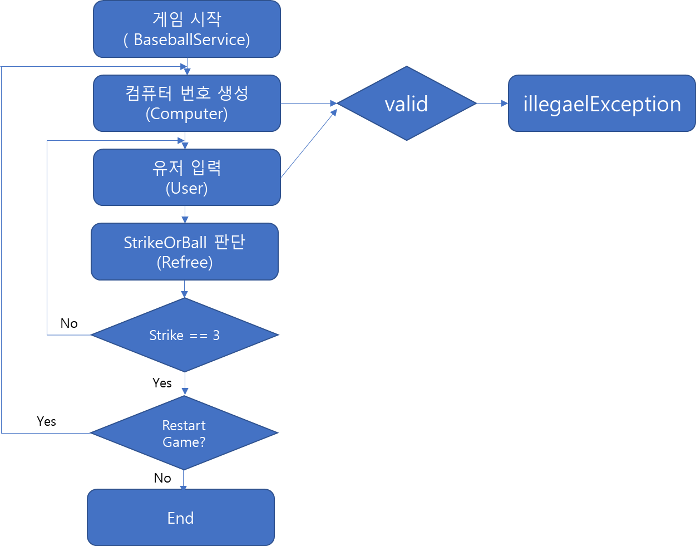

## FlowChart

### 프로그램 구조
    - service
        * BaseballGame
        * User
        * Computer
        * Referee
    - constant
        * Message
    - valid
        * Valid
 
- Baseball Game
  - 컴퓨터가 생성한 숫자를 User가 정확히 입력하면 게임 종료
  - 게임이 종료된 후 User 입력을 받아 게임을 다시 시작하거나 종료할 수 있다.

- User
  - Console 입력을 할 수 있다.
  - 입력한 User 번호를 Return 한다.

- Computer
  - 서로 다른 숫자를 가진 3자리 수 난수를 생성한다.

- Referee
  - 스트라이크, 볼, 낫싱을 판단한다.
  
- Message
  - 진행 중인 상황을 브리핑하는 안내 메시지를 저장소이다.
  
- valid
  - 게임 진행 중 발생하는 예외상황 메소드를 저장소이다.

a
