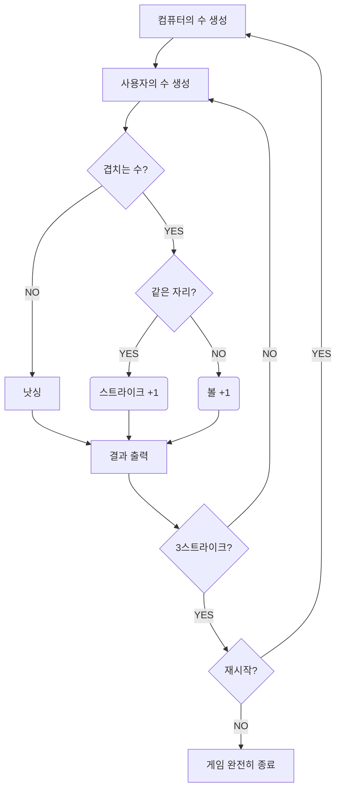

## 게임 플로우차트

## 기능 목록

#### 컴퓨터의 수 생성 `Computer`

- [x] 1에서 9까지 서로 다른 임의의 수 3개를 선택
- [ ] 예외) 숫자가 아닌 경우
- [ ] 예외) 숫자가 3개가 아닌 경우
- [ ] 예외) 중복되는 숫자가 있는 경우

#### 사용자의 수 생성 `Player`

- [x] 세 자리의 수를 입력
- [x] 예외) 숫자가 아닌 경우
- [x] 예외) 숫자가 3개가 아닌 경우

#### 컴퓨터의 수와 사용자의 수를 비교 `Referee`

- [x] 서로 겹치는 수가 있는지 확인
- [x] 겹치는 수가 같은 자리인 경우 스트라이크 +1
- [x] 겹치는 수가 다른 자리인 경우 볼 +1

#### 결과 출력 `Result`

- [x] 스트라이크, 볼의 개수 / 낫싱 출력
- [x] 스트라이크가 3개인 경우 게임 종료 

#### 재시작 검사 `RestartCommand`(Enum)

- [ ] 재시작/종료를 구분하는 1과 2 중 하나의 수를 입력
- [ ] 1을 입력한 경우 재시작`RESTART`
- [ ] 2를 입력한 경우 종료`QUIT`

## 적용하고자 함

1. 정적 팩토리 메서드
2. MVC 패턴