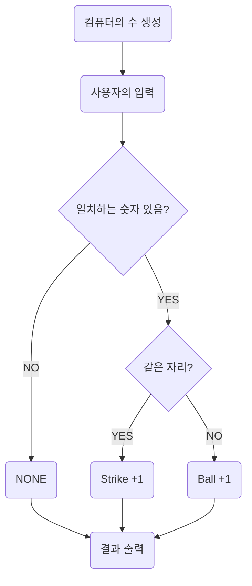

## 구현 플로우차트

## 기능 목록

### 컴퓨터의 수 생성 `Computer`

- [x] 1부터 9까지 서로 다른 수로 이루어진 3자리의 수를 생성한다.
- [x] 중복되는 숫자가 있으면 예외 처리한다.

### 사용자의 수 생성

- [ ] 컴퓨터가 생각하고 있는 서로 다른 3개의 숫자를 입력한다.
- [ ] 세 자리 숫자가 아니면 예외 처리한다.
- [ ] 중복되는 숫자가 있어도 _사용자의 전략으로 보고 예외 처리하지 않는다._
- [ ] 각 숫자가 1부터 9까지의 숫자가 아니면 예외 처리한다.

### 컴퓨터와 사용자의 수 비교

- [ ] 컴퓨터와 사용자의 수를 비교해 같은 숫자의 개수를 찾는다.
- [ ] 공통된 숫자가 같은 위치에 있으면 스트라이크로 계산한다.
- [ ] 공통된 숫자가 다른 위치에 있으면 볼로 계산한다.
- [ ] 컴퓨터가 선택한 3개의 숫자를 모두 맞히면 게임이 종료된다.

### 결과 출력

- [ ] 스트라이크, 볼 개수를 바탕으로 결과를 출력한다.

### 게임 재시작 또는 종료

- [ ] 게임을 종료한 후 게임을 다시 시작하거나 완전히 종료할 수 있다.

- [ ] 사용자가 잘못된 값을 입력할 경우 `IllegalArgumentException`을 발생시킨 후 애플리케이션은 종료되어야 한다.
- [ ] 게임을 종료한 후 게임을 다시 시작하거나 완전히 종료할 수 있다.

## 피드백 사항

- [ ] `Collection` 인터페이스를 사용하는 경우 외부에서 `getter`메서드로 얻은 값을 통해 상태값을 변경할 수 있으므로 `Collections.unmodifiableList({list이름})`을 사용한다.