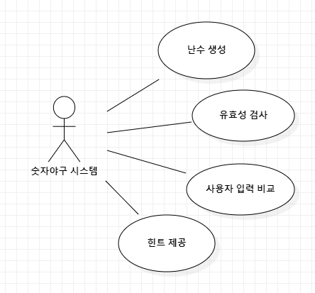
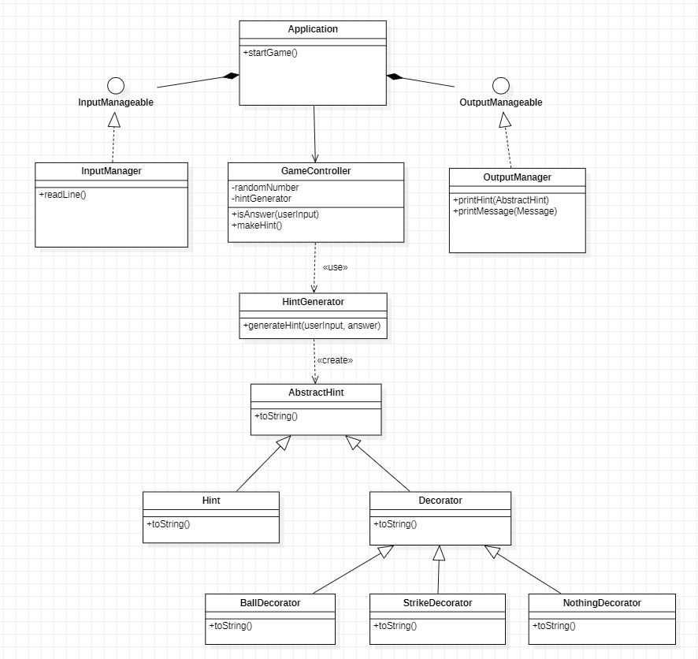
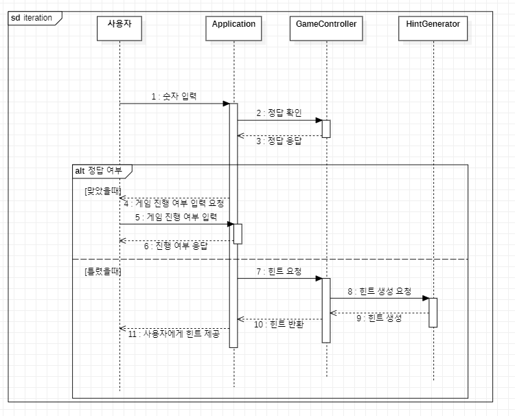

# 기능 구현 리스트 작성

## 유스케이스

1. 게임을 시작한다
2. 컴퓨터는 난수를 생성한다
3. 사용자는 숫자를 입력한다
4. 컴퓨터는 사용자가 입력한 숫자의 유효성을 검사한다
5. 컴퓨터는 사용자가 입력한 숫자와 난수를 비교한다
6. 비교한 결과에 따라서 힌트를 사용자에게 제공한다

## 유스케이스 다이어그램

## 클래스 다이어그램

## 시퀀스 다이어그램

## 기능 구현 리스트

1. 사용자로부터 숫자를 입력 받는 기능 구현
    1. 입력한 숫자가 정상적으로 입력되는지 테스트
2. 사용자 입력이 유효한지 검증하는 기능 구현
    1. 유효하지 않을 때 예외를 반환하는지 테스트
3. 사용자에게 메세지를 출력하는 기능 구현
    1. 모든 안내 메세지가 정상적으로 출력되는지 테스트
4. 랜덤 정수를 생성하는 기능 구현
    1. 10번 생성해서 같은 수가 여러번 나오는지 체크하여 랜덤성 테스트
5. 데코레이터 패턴으로 힌트를 생성하는 기능 구현
    1. 볼,스트라이크 순으로 힌트가 생성되는지 테스트
    2. 낫싱일때 볼이나 스트라이크가 출력되면 예외를 던지는지 테스트
    3. 제공된 힌트가 유효한지 테스트
6. 사용자에게 힌트를 출력하는 기능 구현
    1. 힌트 메세지가 올바르게 출력하는지 테스트
7. 사용자가 입력한 값과 정답을 비교하는 기능 구현
    1. 비교한 값에 맞게 정답 여부를 반환하는지 테스트
8. 정답을 맞췄을때 게임의 진행 여부를 선택하는 기능 구현
    1. 사용자 입력에 맞게 올바른 진행이 되는지 테스트