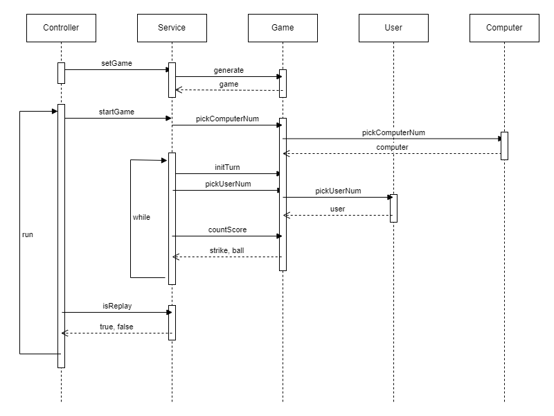

## 📝 구현할 기능 목록
### 1. 컴퓨터가 숫자를 선택
- 1부터 9까지의 서로 다른 수

### 2. 플레이어가 숫자를 입력
- 1부터 9까지의 서로 다른 수
- 그 외 `IllegalArgumentException` 후 종료

### 3. 컴퓨터와 플레이어의 값을 비교
- 같은 수가 같은 자리 : 스트라이크
- 같은 수가 다른 자리 : 볼
- 같은 수가 전혀 없음 : 낫싱

### 4. 결과를 출력
- 정답이 아닐 경우 2번으로 돌아감
- 정답일 경우 재시작/종료를 구분하는 수 입력 
  - 1 입력 시 1번으로 돌아감
  - 2 입력 시 종료
  - 그 외 `IllegalArgumentException` 후 종료

---

## 💡 작동 순서

