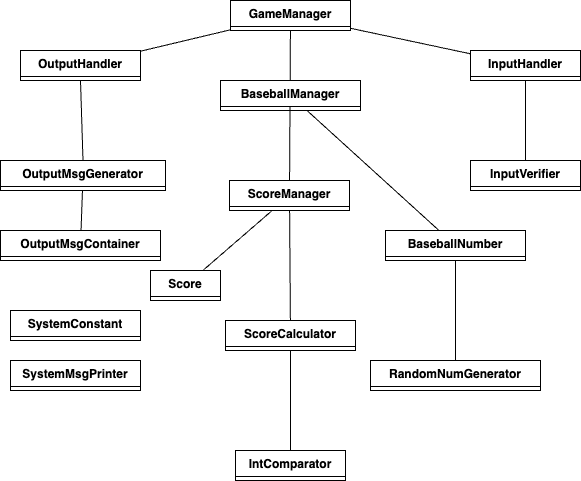

## 📋 구현 대상
### - 클래스 다이어그램

### - 기능 목록 정리

- SystemConstant 클래스
    1. 시스템 관련 상수를 저장하는 기능
          
- SystemMsgPrinter 클래스
    1. 입력을 위한 출력 메세지를 화면에 나타내는 기능
    2. 게임시작 메세지를 출력하는 기능
    3. 게임종료 메세지를 출력하는 기능
         
- OutputMsgContainer 클래스
    1. 예외처리 및 각종 출력을 위한 메세지를 저장하는 기능
          
- OutputMsgGenerator 클래스
    1. 해당 케이스에 맞는 메세지를 반환하는 기능
          
- OutputHandler 클래스
    1. 입력받은 정수에 맞는 메세지를 출력하는 기능
          
- InputVerifier 클래스
    1. 숫자인지 체크하는 기능
    2. 100 ~ 999 의 숫자인지 체크하는 기능
    3. 서로 다른 3개의 수인지 체크하는 기능
    4. 게임 재시작인지 체크하는 기능
    5. 게임 종료인지 체크하는 기능
          
- InputHandler 클래스
    1. 숫자를 입력받는 기능
    2. 입력받은 숫자를 정수형으로 변경하는 기능
          
- Score 클래스
    1. 유저의 최종 점수를 저장하는 기능
    2. 유저의 최종 점수를 반환하는 기능
          
- BaseballManager 클래스
    1. BaseballNumber 객체를 두 개, ScoreManager 한개를 멤버변수로 가짐
    2. BaseballNumber 객체를 초기화하는 기능
    3. 유저의 최종 점수를 반환하는 기능
    4. 유저의 최종 점수를 계산하는 기능
          
- ScoreManager 클래스
    1. Score 객체 한개를 멤버변수로 가짐
    2. 유저의 최종 점수를 계산해 Score 객체에 입력하는 기능
    3. 유저의 최종 점수를 반환하는 기능
          
- ScoreCalculator 클래스
    1. 두 BaseballNumber 객체에서 같은 자리수, 같은 숫자 개수를 반환하는 기능
    2. 두 BaseballNumber 객체에서 다른 자리수, 같은 숫자 개수를 반환하는 기능
    3. 1번, 2번 기능을 조합해 유저의 최종 점수를 계산하는 기능
          
- BaseballNumber 클래스
    1. List 자료구조로 내부 구현
    2. 숫자를 리스트에 자리수마다 저장하는 기능
    3. 입력된 자리수의 숫자를 반환하는 기능
    4. 랜덤 값으로 초기화하는 기능
    5. 지정된 값으로 초기화하는 기능
          
- IntComparator 클래스
    1. 두 정수값이 같은지 비교하는 기능
          
- RandomNumGenerator 클래스
    1. 1 ~ 9 까지 서로 다른 임의의 수 3개를 조합하는 기능
    2. 1 ~ 9 까지 임의의 수를 생성하는 기능
- GameManager 클래스
    1. 게임을 실행하는 기능
    2. 게임 초기화 기능