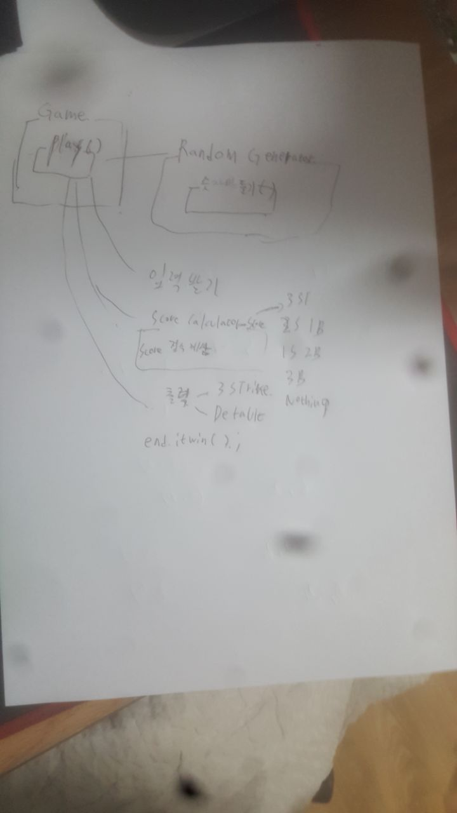

# 과제 진행 요구사항

## 설계

Game을 중심으로, 객체들의 협력을 통해, 구현할예정.

## 구현

Game

1.play()

1. 뼈대 만들기

2. 테스트 코드 만들기

3. 기능구현

4. 리팩토링

2.endifwin()

1. 뼈대 만들기

2. 테스트 코드 만들기

3. 기능구현

4. 리팩토링

NumberGenerator

1. getRandomNumber(int length)뼈대 만들기
2. 테스트 코드 만들기
3. 기능구현
4. 리팩토링

ScoreCalculator

1. calculateScore(int expect,int actual)뼈대 만들기
2. 테스트 코드 만들기
3. 기능구현
4. 리팩토링

Score

1. 인터페이스로, getStrike(),getBall() 뼈대 만들기
2. Score의 구현체들 만들기

Printer

1. Console api를 사용하여 만들기
2. print(Score score)
3. 테스트 코드

Reader

1. Console api를 사용하여 만들기
2. readInt() 만들기
3. 테스트 코드

