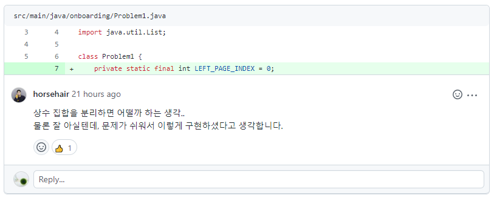
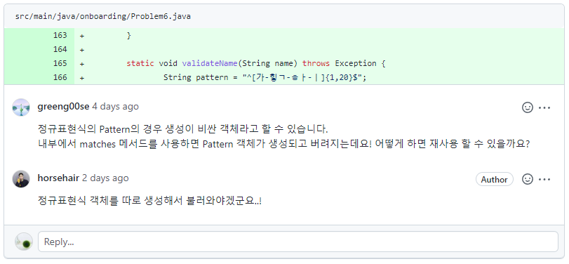
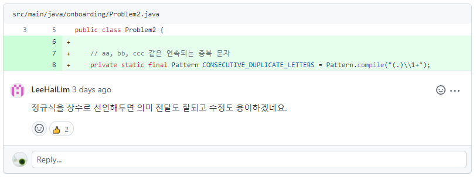

# 구현할 기능 목록

## NumberBaseball (게임을 진행)

- [x] 유저가 중단을 원할 때까지 게임을 실행한다.
- [x] 유저가 완벽한 답을 맞추기 전까지 게임을 진행한다.

## Staff (룰에 기반하여 목표값과 유저의 입력값들을 관리)

- [x] 1부터 9까지의 값을 `camp.nextstep.edu.missionutils`에서 제공하는 `Randoms.pickNumberInRange()`를 이용해 중복 없이 3개 뽑는다.
- [x] 사용자가 제시한 값이 규칙을 제대로 지켰을 경우 변환값을 반환한다. (규칙들은 통과되지 못 했을 경우 `IllegalArgumentException`을 발생시킨다.)
  - [x] 입력값이 NULL이 아닌가
  - [x] 세자리의 값을 제대로 입력했는가
  - [x] 정규식을 사용하여 1부터 9까지의 값이 3번 반복되는지를 확인했는가
  - [x] 값을 변환한다
  - [x] 변환한 값 중 중복값은 없는가
- [x] 유저가 새 게임을 원하는지, 종료를 원하는지 판단한다.

## Referee (게임의 결과에 대해 판단)

- [x] 3스트라이크인지 아닌지 확인한다.
  - [x] 목표값과 사용자의 입력값의 길이가 같은지 확인한다. (혹시 모를 오류 상황 방지)
  - [x] 입력값 3자리를 비교하여 같다면 스트라이크, 포함만 된다면 볼을 판단한다.
  - [x] 판단값을 정리한다.
  - [x] 볼, 스트라이크, 낫싱을 판단해 알려준다.
    - [x] 출력 문자를 만들어주는 메서드를 이용해 답을 맞춘 결과에 따른 문자열을 생성한다.

# 고려한 점

-  `camp.nextstep.edu.missionutils`에서 제공하는 `Randoms`를 이용하여 1부터 9까지의 값을 3개 뽑아야 한다.
  - ~~`Randoms` 내에 `pickUniqueNumbersInRange`라는 메서드가 있다는 것을 발견하였다. 이름만 봐도 중복 없이 값을 뽑는다는 듯 했다.~~
  - ~~매개변수는 `startInclusive`, `endInclusive`, `count`가 있었다. 시작값, 끝값, 뽑을 횟수를  뜻했다.~~
  - ~~내부 코드를 확인해보니, `validateRange`로 범위 값 제한이 올바른지, `validateCount`로 count의 선언이 올바른지를 검사하고 있었다.~~
    - ~~`validateRange`는 시작값 <= 끝값 관계 및 int형에서의 최댓값을 넘어가거나 최댓값 이상의 갯수를 지니는지 확인한다.~~
    - ~~`validateCount`는 뽑을 횟수값이 음수거나 지정한 범위보다 많은지를 확인한다.~~
  - ~~입력이 올바르게 들어왔다면, 해당하는 List를 만든 뒤 시작값부터 끝값을 추가, 랜덤으로 섞은 후 앞에서부터 뽑을 횟수만큼 잘라 반환하는 형태였다.~~
  - ~~로직의 흐름을 충분히 따라갈 수 있었기에, 해당 메서드를 사용하기로 했다.~~
  - `Randoms.pickNumberInRange()`만을 활용하여 구성하여야 했다. 프로그래밍 요구 사항에 있었으나, 깜빡 지나쳐버렸었다. **요구 사항을 잘 읽자..**
-  잘못된 값을 입력할 경우 `IllegalArgumentException`을 발생시키고 종료하여야 한다.
  - 세자리인지 먼저 확인하고 변환하는게, 추후 length 관련 에러를 막을 수 있다고 판단하였다.
  - 세자리는 맞으나 공백 등 정수형으로 변경할 수 없는 경우에도 물론 띄워줘야 한다.
  - 1부터 9까지만 사용해야 하며, 값의 중복은 set으로 판단할 수 있었다.
  - 해당 구조는 `Randoms.pickUniqueNumbersInRange`의 `validateRange`, `validateCount`를 참고하였다.
-  ~~게임의 새 시작과 종료를 구분짓는 메서드에서는 잘못된 값을 입력할 경우 재차 물어본다.~~
  - ~~`종료 == 2` 라는 결정권이 주어졌을 때, `잘못된 값 입력시 종료`를 수행하게 되면 이는 곧 `1 이외 값 입력시 종료` 조건으로 변질될 수 있기 때문~~
-  게임의 새 시작과 종료를 구분짓는 메서드에서도 잘못된 값을 입력할 경우 `IllegalArgumentException`을 도출하도록 했다.
   -  에러로 인해 게임이 중지되는 것과, 정상 중지되는 것은 엄연히 생각하자니 다른 것 같았다. 따라서 해당 부분을 수정하였다.

-  입력값을 검사하는 부분이 맘에 들지 않아 변경해보려고 하였다.
   -  세자리의 값을 입력했는가
   -  1~9의 값만 썼는가
   -  중복된 값이 없는가

-  정규식을 사용해보려 하였으나, 우선 현재의 메서드를 구현 후 정규식을 찬찬히 공부해보기로 하였다.

# 고민한 사항

- 받은 입력값을 3자리로 변환할 수 있는지를 확인하고, 가능하다면 변환하여 검사해야 한다. 이 때, 변환하여 검사 후 이상이 없다면 반환하게끔 구성한다면.. 메서드 이름을 어떻게 지어야 할 것인가?
  - 기존 코드 작성 방향은 `값 입력` -> `제대로 된 입력인지 확인` -> `제대로 된 입력이라면 변환하여 사용` 순으로 하려 했으나, `값 입력` -> `제대로 된 입력인지 직접 변환하여 테스트, 이상 없다면 반환`으로 변경하는 게 좋을 것 같다는 생각이 들었다.
  - 그러나, 이런 구조라면 메서드명을 어떻게 지어야 할 지 난감했다. 확인받은 후 이상이 없다면 값을 반환받는 것이니, `ifValueIsAcceptable`로 하려 했는데 다른 사용자가 보고 납득할 수 있는지 감이 잘 오지 않았다. 값을 반환받는 느낌보다 확인한다는 느낌이 더 강하게 들었다.. 우선은 값을 가져온다고 표현해주는 게 먼저일 것 같아 `getValueIfAcceptable`로 적었는데, 이것도 약간 마음에 들진 않는다. 더 좋은 메서드명을 위해 고민해봐야 할 것 같다.

# 트러블 슈팅

## 경고 출력문

```
WARNING: An illegal reflective access operation has occurred
WARNING: Illegal reflective access by camp.nextstep.edu.missionutils.Console (file:/C:/Users/eora2/.gradle/caches/modules-2/files-2.1/com.github.woowacourse-projects/mission-utils/1.0.0/dad5230ec970560465a42a1cade24166e6a424f4/mission-utils-1.0.0.jar) to field java.util.Scanner.sourceClosed
WARNING: Please consider reporting this to the maintainers of camp.nextstep.edu.missionutils.Console
WARNING: Use --illegal-access=warn to enable warnings of further illegal reflective access operations
WARNING: All illegal access operations will be denied in a future release
```

반복문을 통해 입력을 받다가 해당 경고가 출력되었다.

구글링을 해 보니, JDK 버전과 타 라이브러리 버전이 맞지 않아 생긴 문제라고 한다.

하지만 프리코스에서는 JDK 11버전을 사용하며, `build.gradle` 파일을 변경할 수 없고, 무엇보다 **JDK 11에서 정상적으로 동작하지 않을 경우 0점 처리**를 하기에.. `일부러 이런 에러가 뜨게끔 구성한건가? 아니면 내 코드 문제일까?`에 대해 고민했다. 단순 경고창을 띄우는 거라곤 하지만.. 그래도 불안한 건 어쩔 수 없는 것 같다.

## 테스트 코드

```java
@Test
void 게임종료_후_재시작() {
    assertRandomNumberInRangeTest(
        () -> {
            run("246", "135", "1", "597", "589", "2");
            assertThat(output()).contains("낫싱", "3스트라이크", "1볼 1스트라이크", "3스트라이크", "게임 종료");
        },
        1, 3, 5, 5, 8, 9
    );
}
```

해당 구문을 보면, 답을 `135`와 `589`를 강제해놓고 코드를 돌리는 듯 했다.

헌데 `assertRandomNumberInRangeTest`의 매개변수는 `final Executable executable`, `final Integer value`, `final Integer... values`였고, 따라서 `value`에는 `1`이, `values`에는 `3, 5, 5, 8, 9`가 들어가는 형태였다.

이게 어떤 의미로 이렇게 들어간 건지, 저렇게 넣으면 값이 고정되는지 코드를 출력해봤으나, 내 코드 기준에서는 목표값으로 빈 리스트만 출력되고 있었다.

내 짧은 견해로는, `mock.when(verification).thenReturn(value, Arrays.stream(values).toArray());` 코드에서 랜덤 값을 `1, 3, 5, 5, 8, 9` 순으로 고정시키는 것 같은데, 왜 내 코드에서는 작성되지 않는지 의문이다. `pickUniqueNumbersInRange()`를 사용해서 그런 걸까?

혹시나 하는 마음에 `pickNumberInRange()`를 사용하여 코드를 돌려보았는데.. 정답이 떴다.. `프로그래밍 요구 사항` 중 `라이브러리` 항목에 `pickNumberInRange()`를 활용하라고 떡하니 적혀 있었는데, 이를 놓치고 헛고생을 하고 있었다..

반성할 시간을 가졌다. 그래도 그 과정에서 배운 것은, 역시 메서드를 쪼개 놓으니 딱 원하는 부분만 수정하여 결과를 얻어낼 수 있었다는 점이다.

또, `pickUniqueNumbersInRange()`에서는 왜 안돌아간 건지 궁금해져서 찾아보기로 했다.

### `pickUniqueNumbersInRange()`에서는 왜 안돌았을까

#### 코드를 보며 가정

`Assertions` 클래스 내부에 `assertRandomNumberInRangeTest`와 `assertRandomUniqueNumbersInRangeTest`가 따로 있는데, 해당 메서드들은 `assertRandomTest`에 `pickNumberInRange`와 `pickUniqueNumbersInRange`를 각각 지정한다.

해당 코드는 `mockStatic(Randoms.class)`로 지정한 mock의 `when`으로 넘어간다. 만약 지정한 메서드가 코드 내에서 동작한다면, 전달받은 `value, values`에 해당하는 값들이 튀어나오는 구조인 것 같다.

#### 실제 찾아보며 확인

우선 [Mock이 무엇인지](https://medium.com/@SlackBeck/mock-object%EB%9E%80-%EB%AC%B4%EC%97%87%EC%9D%B8%EA%B0%80-85159754b2ac)부터 찾아보았다. 해당하는 글을 읽고 Mock이 어떤 형태인지를 (완벽히는 당연히 아니지만) 이해할 수 있었다.

또한 테스트 코드 내부에서 `mockStatic`을 사용했는데, 이는 `Mockito`에서 static 메서드를 mock으로 지정하여 테스트하는 방법이라고 한다.

#### 이런 구조인 것 같은데?

> 이 역시 어디까지나 가정이니, 틀린 부분이 있다면.. 어떻게든 알려주셨으면 좋겠다 ㅠ

`Mockito`를 이용하여 가짜 객체를 생성하고, `해당하는 함수가 돈다면 이러한 결과만을 반환하라`고 지시하는 것 같다. 즉, 해당 테스트는 `pickNumberInRange()` 메서드에 원하는 값들을 출력하도록 한 Mock 객체를 생성한 것이고, `pickUniqueNumbersInRange()`에 대한 지정이 없었으니 반환형에 대한 빈 값이 나오도록 설정되어 있었으며, 따라서 해당 메서드에서는 빈 List 객체가 나왔던 듯 하다.

이후 `pickNumberInRange()`를 사용하는 방향으로 수정한 이후에는, 내가 작성한 main문이 돌 때 `Randoms`클래스 대신 `Randoms` 클래스를 상속받은 Mock 객체를 받아왔고, `pickNumberInRange()`를 호출했을 때 `1, 3, 5, 5, 8, 9`가 차례대로 호출되어 원하는 답이 나오도록 조절된 상태이므로 해당하는 테스트가 정상 수행된 것 같다.

# 리팩터링

## 명확한 의미를 지니도록 하자

- 유저가 입력한 값을 숫자 리스트로 변환받는 메서드명을 `getNumsListIfAcceptable`로 작성했었다. 물론 List로 받는 건 맞지만, 메서드 명만 봐서는 어떠한 의미를 갖는 List를 반환받는지 모를 것 같았다. 따라서 `getUserInputNumbersIfConvertible`로 변경해 주었으며, 관련 메서드명도 해당 규칙에 맞게 변경하였다.
- 0은 허용되지 않은 숫자이다. 0의 사용 유무를 확인하던 메서드는 `validateUse0`이었으며 코드 내에서 0 자체를 놓고 비교하였다. 그러나 이것 또한 매직넘버라 판단하여, 0을 `FORBIDDEN_NUMBER`로 치환하였다.
- `숫자는 1부터 9까지만 사용되어야 합니다. 0을 포함할 수 없습니다.`라는 설명 또한, 범위값과 허용되지 않은 숫자가 변경된다면 같이 바뀌어야 한다고 생각했다. 따라서 `"숫자는 " + START_NUMBER + "부터 " + END_NUMBER + "까지만 사용되어야 합니다. " + FORBIDDEN_NUMBER +"을 포함할 수 없습니다."`라는 코드로 변경하였다.
- 코수타에서도 `i`에 대해 얘기가 나왔던 걸로 기억한다. 보통 인덱스나 특정 숫자의 범위값을 차례로 채우기 위해 사용하는데, 이 또한 `idx`로 명확하게 표현 가능하도록 하였다.
- 사용자가 확실한 정답을 맞추거나(스트라이크), 정확하진 않지만 범위 내의 값을 제시했을 경우(볼) 해당 대답을 정리하는 메서드에서 카운트를 올려주는 방식이었는데, 매개변수 이름을 `answer`로 했었다. 답을 정리하는 건 맞지만 여러 해석이 가능하다고 생각하여 `accuracyResult`로 이름을 변경하였다.
- 외에도 의미가 명확하지 않다고 느끼면 계속 수정했다.

## 클래스를 쪼개는 게 좋을까..?

-  현재 `NumbersBaseballGame` 내에는 많은 메서드가 있다. 크게 세가지로 나눈다면 밑의 내용과 같을 것이다.
   -  목표값을 설정
   -  사용자의 입력을 확인
   -  입력값을 통해 스트라이크, 볼 판단
-  위와 같은 형태를 각각의 클래스로 쪼개어 유지하는 게 좋은 방법일지 많이 고민했다.
   -  장점
      -  게임에 필요한 목표값을 계속 쥐어주는 클래스가 있다면, 목표값의 설정이 바뀌어도 하나의 클래스에서만 신경쓰면 된다.
      -  사용자는 입력을 받는 클래스와 계속 응답을 주고받으며, 검증된 입력을 게임에서 사용한다.
      -  입력값을 스트라이크와 볼을 판단하는 심판 역할의 클래스에게 넘겨주고, 심판의 응답에 따른 결과를 사용자에게 보여준다.
   -  단점
      -  게임은 하나의 룰을 가진 객체다. 목표값의 설정이 바뀐다면 룰이 바뀌는 것이고, 이는 두 클래스를 모두 수정해야 하는 결과를 낳을 수도 있다.
      -  입력 검증 또한 하나의 룰에 기반한 내용이다.
      -  스트라이크와 볼도 마찬가지로 하나의 룰이며, 만약 파울같은 추가적인 설정이 들어간다면 두 클래스를 모두 관리해야 한다.
   -  위와 같은 결과를 도출했기에 따로 분리하지 않기로 했다.
-  전처럼 플레이어와 게임으로 만드는 건 어떨까?
   -  플레이어에게 주어진 룰이 있을까..? 현재 룰을 컨트롤하는 건 게임 자체이다.
   -  엇.. 이렇게 생각하면 1회차의 1번 문제에서 플레이어를 쪼개지 말았어야 하는건가..
      -  여러 명의 플레이어가 존재하고, 플레이어마다 지녀야 할 데이터들이 있었다면 따로 두는 게 맞았을 것 같다. 그러나 해당 문제를 떠올려보면, 굳이 나누지 않아도 되었을지도.. 오히려 쪼개놓은 것 때문에 복잡도를 올렸던 게 아닐까 생각이 든다.
-  그럼 클래스는 언제 쪼개야 하는 것일까..?
   -  **역할이 구분될 때** 클래스를 쪼개야 한다.
   -  현재 `NumbersBaseballGame` 클래스는 유저가 게임을 수행할 수 있게 제공하고 있다. 만약 유저에게 숫자야구를 비롯한 100개의 게임을 제공해야 한다면?
      -  이 때는 게임의 상위 객체를 선언하고, 이를 상속받는 게임들을 만들고.. 분리를 하지 않고서는 메서드가 매우 복잡해질 것이다.
   -  `누군가에게 기능이 부여될 때`로 생각해도 되지 않을까?
      -  위와 같은 예시라고 하면, 여러 게임을 제공하는 `게임기`와, 유저에게 룰을 제공하는 `게임`으로 나뉘게 되는거니까.. 
      -  만약 이렇게 되면, 입력값을 제공받는 기능도 따로 분리되어 게임기에 들어가야 할 것이다.
      -  게임의 룰과 입력값은 계속 상호작용하게 될 것이다. 하지만 게임기 자체에서 입력값(A버튼, B버튼 등)을 제공하여, 올바르지 않은 값을 게임에게 넘기지 않게끔 할 것이고, 게임은 해당 버튼들에 대한 이벤트를 구현하는 걸로 변경될 것 같다.
   -  특정 메서드의 입장에서, 독립적으로 돌아갈 수 있으면 해당 부분이 클래스가 되는 건 아닐까?
      -  여러 객체에게 같은 작업을 부여하는 중복된 메서드가 있다면, 해당 메서드는 따로 클래스로 작성되어 서로의 필요관계에 의한 값을 주고받을 것이다. 메서드의 기능이 전반적인 룰이 되는 것이고, 이는 곧 클래스의 역할이 되는 것이니까..?
-  대충 감은 오는데.. **어렵다.** 아무튼 현재로서는 게임의 전반적인 룰 밑에서 모든 것들이 동작되기에, 클래스를 구분하지 않는 것으로..!

## 상수 집합



토요일에 다른 분들의 리뷰를 보다가, `상수 집합 분리`라는 키워드를 발견했다. Enum을 따로 선언하여 사용하는 걸 말씀하시는 것 같았다.

이번 프로젝트에서 상수를 굉장히 많이 선언하게 되었으므로, 한번 알아보기로 했다.

마침 [우형 기술블로그에 Enum 활용기가 서술되어 있어서](https://techblog.woowahan.com/2527/) 정독 후 참고해보기로 했다.

```java
START_NUMBER(1),
END_NUMBER(1),
PICK_COUNT(3),
FORBIDDEN_NUMBER(0),
DEFAULT_VALUE_IF_KEY_DOES_NOT_EXIST(0),
CORRECT_ANSWER("strike", "스트라이크"),
SIMILAR_ANSWER("ball", "볼"),
WRONG_ANSWER_KOR("낫싱"),
USER_WANT_MORE("1"),
USER_WANT_FINISH("2");
```

그러나 위와 같이 나눠 놓으니, 형식이 너무 제멋대로였기 때문에 `숫자야구 규칙 상수`, `답 정확도 상수`로 나눠놓기로 했다.

헌데 인자를 하나씩만 가진 값들은 오히려 값을 가져오는 메서드를 사용하며 가독성이 저하되는 것 같았다. 따라서 `답 정확도 상수`만 우선 enum으로 선언하고, 나머지는 static class로 해보기로 했다.

헌데 또 막상 나누고 나니 `숫자야구 규칙`, `정확도 판단`, `숫자야구 게임`으로 `클래스를 쪼개는 게 좋을까..?`의 고민내용과 비슷한 형태가 생성된 듯 했다. 또한, `FORBIDDEN_NUMBER`가 규칙에 포함되며 `사용자의 입력 자체를 확인시켜주는 클래스를 짤 수 있을 것 같은데..? 타겟값과 사용자 입력값 관련 규칙만 책임지는 클래스를 만들면, 게임 진행과 따로 분리시켜도 괜찮지 않을까?` 라는 생각을 하게 되었다.

또 이렇게 되니 욕심이 날 수 밖에 없었다. 따라서 시도해보기로 했다.

## 숫자야구 진행, 타겟값 및 입력값 규칙, 정확도 판단의 클래스들

숫자야구를 진행하는 클래스는 변경할 게 없었다. 오히려, 현재 상태에서 메서드들을 덜어내 다른 클래스들에게 쥐어주면 되는 형태였다.

정확도 판단 클래스는 `Referee`라고 명명하여 스트라이크, 볼을 판단하는 심판을 쉽게 떠올릴 수 있게 했다.

다만, 타겟값 및 입력값의 규칙을 제정하고 확인하는 클래스의 이름을 무엇으로 해야 할 지 고민이었다. 단순하게 사용자 입장에선, 플레이어 본인이 투수이니 `Pitcher`라고 지어볼까? 했는데, 타겟값을 설정하는 것까지 들고 있으면 명확한 의미를 주지 못 하는 것 같았다. 그렇다면 포수와 투수를 함께 부르는 `Battery`는 어떨까? 했는데 야구 용어를 모르는 분들은 아예 와닿지 않을 거고, 아는 분들도 갸웃할 것 같았다. 차라리 그렇다면, 야구 게임을 돕는 `Staff`라 한다면 어떨까? 했는데 의외로 괜찮은 것 같아 이대로 진행해보기로 했다.

헌데.. 작성하다보니 스트라이크와 볼에 대한 영문과 한글을 같이 적을 필요가 없었다. 해당하는 것들도 다 규칙에 넣어버렸다.

상수값을 건드리다가 클래스를 나눴는데, 상수값들이 다 하나짜리로 묶이다니.. 그래도 클래스를 나누고 나니 속이 다 시원해졌다. 작성하면서 구현할 기능 목록을 다시 정리하기도 했고, 설명 또한 명확하게 해보려 노력했다.

## 상수와 enum에 대해 다시 고민

클래스를 분리하고 난 이후, 모든 상수값들을 static final로 선언하여 하나의 클래스에서 지니고 있었다.

헌데, 해당 구조가 옳은지에 대한 의문이 들어 다시 enum 객체로 전환해야하나 고민하다가, `어떤 기준으로 둘을 나눠야 하는가`에 대해 깊게 고민하게 되었다.

둘에 대해 장단점을 비교하며 생각해봤지만, 결론은 뚜렷하게 나오지 않았다. 오히려 `1~9의 값을 3개 뽑아라`하는 형태에서는 값들을 나열하는 게 아닌, 특정 값을 지정하는 형태이기 때문에 상수가 더 낫지 않나 하는 의구심이 들었다.

만약 enum객체로 선언했을 때 좋은 형태를 가정한다면, `1~9 3개`, `2~7 5개` 등 특정 `mode`의 변경에 따라 입력값의 범위와 갯수가 바뀐다면 이는 `mode`에 대한 enum 객체들을 생성하고, 코드 내에서 `mode`를 교체하는 경우 사용하기 좋은 것 같았다.

또는 단순 enum으로는 `0, 1, 2, 3, 4, ...`같은 순차적인 데이터(월, 계절 등)를 사용하기에 좋았다.

즉, enum은 상수를 기반으로 특정 메서드의 input이나 output을 제한하거나 스스로 메서드를 구성할 수 있는 상태, 혹은 단순 나열값에 대해 막대한 이득을 가져올 수 있는 듯 보였다.

따라서 상수로 지정한 값 하나하나에 집중하여, `단순 이용당하는 녀석인지, 혹은 메서드의 입출력을 제한하거나 스스로 독립하여 메서드를 선언할 수 있는지`를 생각해보았다.

### 1~9의 값을 3개 뽑아라

1과 9, 3을 생각해보았다.

1과 9는 범위의 시작과 끝이며, 3은 단순 갯수이다.

3은 따로 동떨어져 있는 녀석이며, 묶이는 그룹이 없으므로 상수로 선언하기로 했다.

1과 9는 묶이긴 하지만, 단순 나열이 아니며 값의 결과를 제한하긴 하지만 숫자 객체 하나마다 영향력이 있다곤 볼 수 없다. 내부에서 설정값으로 쓰이기 때문이다. 따라서 이 값들도 상수로 선언하기로 했다.

### 스트라이크, 볼, 낫싱 판정

`스트라이크, 볼,낫싱`은 내가 넣은 값이 일치하는지 아닌지에 따른 상태이다. 단순 나열인가..? 싶기도 하지만 순차적이지 않으며, 게임의 결과를 설명해주는 문자열이기에 이 또한 메서드의 입출력 제한이나 독립할 수는 없다고 생각했다.

### 새 게임 시작, 중지

이 또한 사용자의 입력값을 받아 게임을 시작할지, 중지할지 비교하는 부분이었다. 만약 단순 시작과 중지가 아니라, 게임의 모드 자체를 변화시키는 거라면(Easy, Normal, Hard) 그건 사용할 만 하다 싶었다. 해당 값마다 내부 설정값이 있을 것이고, 전반적인 게임들의 메서드에서 막강한 영향력을 끼칠 테니까 말이다.

하지만 그저 true, false를 판단하는 상황에서는 역시 상수값으로 두는 게 나을 것 같다는 판단이 되었다. `NEW_GAME("1", false), DONE("2", true)`로 두고 관리하는 형식을 생각하기도 했으나, TF 결과를 도출하는 것 치곤 너무 큰 상태를 유지해야 하는 것 같다.

## 상수값으로 인한 클래스 구조 살짝 변경

PICK_COUNT는 `몇 개의 목표값을 지정할 지 선택`하는 값이다.

해당 값은 Staff에서 두고 사용하려 했는데, Referee에서도 `몇 개의 값을 맞춰야 완벽한 답인지를 판단`하는 값이기도 하다.

같은 의미를 가진 값을 두 곳 모두에 사용하는건 옳지 않다고 생각했다. 그럼 PICK_COUNT를 Staff와 Referee를 모두 선언하는 NumberBaseball에 선언해야 할까?

해당 값은 야구게임의 진행과는 별개로, 게임의 룰에 의한 값이므로 Staff에 두는 것이 낫다고 판단했다. 따라서 NumberBaseball은 Staff와만 대화하며, Staff는 룰에 맞게 상태를 설정하고 심판을 호출하도록 변경하기로 했다.

그렇게 생각하고 나니 현재 `게임을 새로 시작하려면 1, 종료하려면 2를 입력하세요.`, `3개의 숫자를 모두 맞히셨습니다! 게임 종료`에 대한 내용과 더불어 유저의 input을 받는 게 NumberBaseball에 있었다. 해당 클래스는 게임의 흐름을 담당하기로 했으므로, 게임 상태 출력과 유저의 입력을 받는 건 타당했다. 그렇다면 게임의 흐름은 곧 게임 룰을 기반으로 흘러가야 했고, `게임의 룰을 Staff가 지니는 게 맞나?` 라는 생각이 들었다.

게임의 룰에 직접적으로 영향을 받는 건 Staff가 맞다. 그러나, Staff는 어디까지나 게임의 룰에 맞게 움직일 뿐이지, 룰 자체를 지니고 있으면 안된다는 생각이 들었다.

그럼 모든 규칙을 NumberBaseball이 지녀야 하는가?

값의 범위와 뽑는 횟수, 1 또는 2로 유저의 게임 진행 결정은 NumberBaseball이 지니되, 해당 규칙을 이용하여 정규표현식을 만드는 건 Staff, 스트라이크와 볼, 낫싱은 Referee가 지니고 있으면 될 것 같았다.

여기서 Referee가 완벽한 답인지를 판단하는 게 아닌, 스트라이크의 갯수를 반환하고 Staff에서 해당 갯수를 비교하는 게 나을 것 같았다. Referee는 단지 자신이 판단한 값만 반환한다면, PICK_COUNT를 몰라도 되기 때문에 둘의 관계가 약해질 수 있다고 판단했다.

따라서, 기존과 같은 구조를 지니되 게임의 룰은 NumberBaseball, 해당 룰을 기반으로 정규식을 만들고 유저의 input을 확인하는건 Staff, 게임의 결과를 정리하여 유저에게 알려주고, 판단한 값을 넘겨주는 Referee의 각각 역할에 맞게 상수를 배분하고 유지해보기로 했다.

## 정규표현식 사용

[프로그래머스의 정규표현식 강의](https://school.programmers.co.kr/learn/courses/11)를 풀어보고, 1부터 9의 3자리 입력을 판별하는 방법에 대해 알게 되었다. 정규식의 사용으로 validate 구문을 좀 더 명확하고 간편하게 가져가보기로 했다.





지난번 디스커션의 피어리뷰 때 다른분들의 코드를 구경하다, 정규식 관련한 리뷰를 봤었다. 해당 리뷰들을 참고하여, 나도 Pattern을 상수로 선언하여 사용해보기로 했다.

`Int형으로 변환이 가능한가`, `허용되지 않은 0을 사용하진 않았는가`를 `정규식을 사용하여 1부터 9까지의 값이 3번 반복되는지를 확인했는가`로 변경하기로 했다.


# 느낀 점

- 코드를 작성하는 시간보다 README의 `구현할 기능 목록`을 고민하고 수정하는 시간이 더 많은 것 같다. 코드를 타이핑하다 보면 빼먹거나 순서를 잘못 생각한 기능들을 파악하게 되고, 해당하는 사항들을 정리하며 머릿속으로 로직을 다시 생각하는 과정이 반복된다. 실력이 증가하는 과정이겠지만, 그동안 정말 대책없이 코드를 작성했구나 하며 반성하게 된다.
- 실력의 부족함을 처절히 느끼고 있다. 객체지향이란 무엇인가? 클린코드란 어떻게 지켜나갈 수 있는 것인가? Java의 기본도 모른 채로 그냥 사용하는 것은 아닐까? 공부해야 할 것들이 너무나 많고, 갈 길이 멀다. `거만한 코더`가 아니었나 하는 생각이 든다..