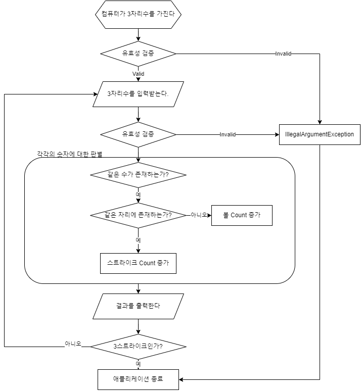

# 프로그램 흐름

## 🚀 기능 요구 사항

### 컴퓨터가

- [ ] 랜덤한 3자리수를 생성한다

Answer 객체로 반환한다

### 사용자가

- [ ] 3자리수를 입력한다
    - [ ] ! 숫자가 아닌 값이 들어오면 예외
    - [ ] ! 3자리 수가 아니면 예외
    - [ ] ! 중복된 숫자가 존재하면 예외

- [ ] 게임 재시작을 입력한다
    - [ ] ! 1 : 재시작 / 2 : 종료 이외의 값이 들어오면 예외

### 점수 판별기가

- [ ] 같은 수가 있는지 판별한다.
    - [ ] 같은 위치에 있는지 판별한다.
        - [ ] 같은수가 같은 위치에 있으면 Strike Count가 증가
        - [ ] 같은 수가 다른 위치에 있으면 Ball Count가 증가

- [ ] 판별 결과를 반환한다

점수는 ScoreBoard로 관리

### 컨트롤러가

- [ ] 게임 진행을 관리한다.
    - [ ] 3자리수 입력받기 - 비교 - 결과출력
    - [ ] 재시작 여부 판단