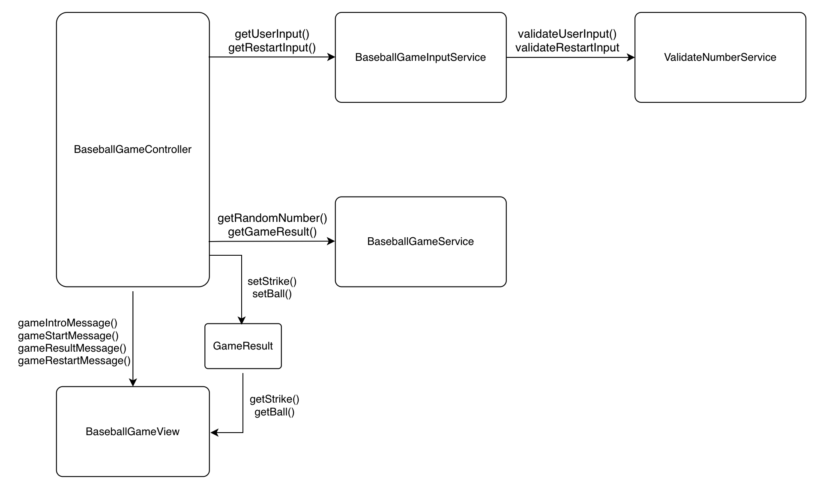

# 구현할 기능 목록
## Controller
### BaseballGameController
- gameIntro() : 숫자야구게임 시작을 위한 인트로 메시지를 출력
- gameProcess() : 숫자야구게임 시작과 조건에 따라 반복하도록 한다. 
  - gameStart() : 숫자야구게임을 Service로직을 실행시켜 결과를 Model에 넣어 View로 동적으로 생성하도록 구현한다. 
  - isGameRestart() : 숫자야구게임을 시작할지 말지 여부를 결정한다.
## Service
### BaseballGameInputService
- getUserInput() : camp.nextstep.edu.missionutils의 Console API를 사용하여 user의 Input을 받도록 한다. 여기서 validateUserInput()으로 검증한다.    
- getRestartInput() : camp.nextstep.edu.missionutils의 Console API를 사용하여 user의 restartInput을 받도록 한다. 여기서 validateRestartInput()으로 검증한다.
### BaseballGameService
- getGameResult() : User의 숫자야구게임의 정답을 받고, 해당  Strike, ball여부를 계산하여 List로 반환한다. 
- getRandomNumber() : 게임에 필요한 숫자 3자리를 camp.nextstep.edu.missionutils의 Randoms API를 사용하여 구현한다. 
### ValidateNumberService
- validateUserInput() : 답안을 검증하는 user의 input이 조건을 만족하는지 체크한다. 
  - validateDigitRangeFromOneToNine() : 1~9 숫자로 이루어졌는지 검증
  - validateDuplicatedDigitExists() : 중복된 숫자가 있는지 검증한다. 
  - validateNumberLengthThree() : 3자리로 이루어졌는지 검증한다. 
- validateRestartInput() : input이 1혹은 2인지 확인한다. 
## Model
### GameResult
- GameResult : View에 전달할 객체, Game 결과 strike의 결과와 ball의 결과를 저장한다. 
## View
### BaseballGameView
- gameIntroMessage() : 숫자야구게임을 시작한다는 메시지를 출력한다. 
- gameStartMessage() : 숫자 입력을 위한 메시지를 출력한다. 
- gameResultMessage() : strike, ball의 값을 동적으로 할당받아 해당 값의 조건에 따라 스트라이크, 볼, 낫싱 메시지를 출력한다. 
- gameRestartMessage() : 3strike를 맞추었기에, 게임을 재시작할지의 여부를 유저에게 물어보는 메시지를 출력한다. 

