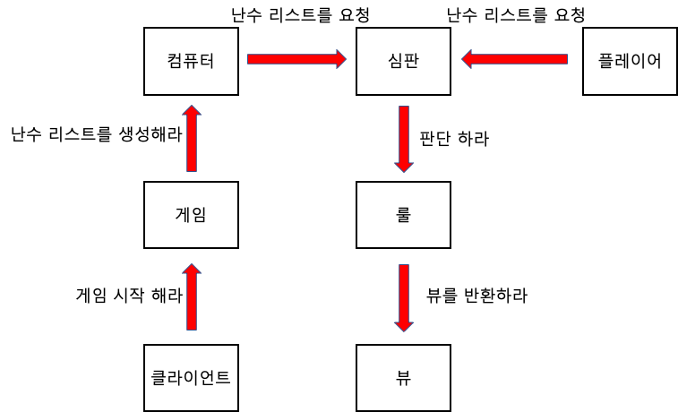

# 구현할 기능
## 예상 코드 흐름 

 

## 기능 목록
### GameSystem (야구게임)
- [ ] 게임시작 하기
  - 게임 초기화
  - `Computer` 랜덤숫자 선택 진행
- [ ] 결과 확인하기
  - 컴퓨터로 부터 전달받은 `GameResult`를 확인함
- [ ] 전달받은 결과 출력하기
  - 컴퓨터로 부터 전달받은 `GameResult`를 확인함
- [ ] 정답이후 게임 계속할지 확인하기
  - 사용자로부터 `GameProgress` 값을 입력받는다

### Player
- [ ] 값 입력하기
  - 콘솔로 값을 입력받는다 `Console.readLine()`
  - [ ] 숫자 추측용 값 입력
    - [ ] 숫자 추측용 값 검증
      - allowedNumbers(1~9) 숫자만 허용
      - 즉, 0은 허용되지 않는다
      - 잘못된 입력을 받을시 예외를 발생시킴 (`IllegalArgumentException`)
    - 3개 만큼의 데이터를 입력
    - `BaseballNumberBundle`에 입력값을 저장
  - [ ] 게임진행여부 값 입력
    - [ ] 게임진행여부 값 검증
      - 0 or 1 숫자만 허용
      - `GameProgress`의 CONTINUE, EXIT와 대치
      - 잘못된 입력을 받을시 예외를 발생시킴 (`IllegalArgumentException`)
    - 1개의 데이터를 입력받아야 한다
    - `GameProgress` 형태의 값을 반환
- [ ] 숫자 입력 전처리
  - whiteSpace 문자를 제거한다. (' ', ',', '.', '\n')

### Computer
- [x] 임의로 생각한 숫자(정답)을 저장하는 변수 (`BaseballNumberBundle`)
- [x] 랜덤숫자 선택하기
  - ~~선택된 숫자를 기억하는 SET 변수~~
  - [x] 선택된 숫자를 기억하는 List 변수
  - [x] 임의의 숫자 한개 선택
    - 랜덤 int 값을 선택 `Randoms.pickNumberInRange(1,9)`
    - 선택된적 없는 숫자만 선택
  - [x] 이미 나온 숫자인지 확인
    - is number in LIST
    - return boolean
  - [x] 임의의 숫자 기억
    - 선택된 3개의 숫자를 변수에 저장함
- [x] 결과 확인 (컴퓨터에게 결과를 물어본다)
  - [x] 전체 숫자에 대해 결과를 확인
    - 두 리스트의 항목을 순차적으로 비교
    - 항목과 인덱스가 같은 경우 strike++
    - 항목은 같으나 인덱스가 다른 경우 ball++
  - [x] 확인된 결과를 종합해 결과 반환

### BaseballNumberBundle (숫자묶음)
- [x] 야구 게임에 사용되는 숫자 묶음 (3개의 서로다른 수)를 기억하는 클래스

### GameResult (야구게임 결과)
- [x] 야구 게임 결과를 저장하는 클래스
  - ball (int)
  - strike (int)
  - result (`GameState`) = 초기값은 `GameState.NOTHING`
  - addStrike() : strike를 하나 증가시키는 메소드, 3스트라이크인 경우 result가 `GameState.CORRECT`
  - addBall() : ball을 하나 증가시키는 메소드
  - numberAtLeastOnce() : addStrike(), addBall()이 한번이라도 실행될 때 result를 `GameState.GOOD`으로 설정
  - isCorrect() : strike가 3개인지 확인하는 함수

### GameProgress (Enum)
- [x] 게임진행여부 case를 나타내는 enum
  - CONTINUE
  - EXIT

### GameState (Enum)
- [x] 야구게임 결과에 대한 case를 나타내는 enum
  - NOTHING
  - GOOD
  - CORRECT

### 테스트
- [ ] 기능별 테스트 작성
