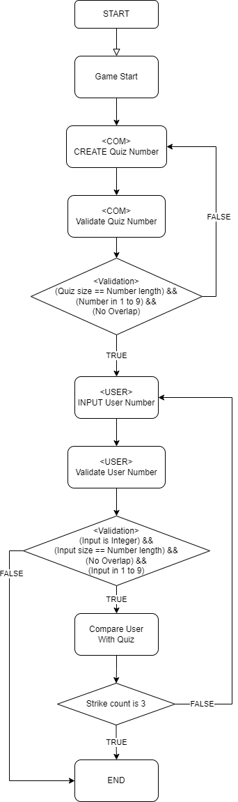

# ⚾야구 게임
## 우아한테크코스 5기 - 프리코스 2주차 미션

---
## 📑구현 기능 목록

### 1. 문제를 내는 사람 (COM)
* 생성
  * 1에서 9까지 서로 다른 임의의 수를 3개

* 검증
  * 볼의 개수
  * 스트라이크 개수

### 2. 문제를 맞추는 사람 (USER)
* 입력
  * 1부터 9까지 서로 다른 수로 이루어진 3자리의 수
  * 게임이 끝난 후 재시작/종료를 구분하는 1과 2 중 하나의 수

### 3. 게임 진행
* 게임 초기화
  * 맞출 숫자 생성
* 게임 진행
  * 사용자가 숫자 입력
    * 입력한 숫자 검증
  * 스트라이크 및 볼의 개수 출력
  * 전부 스트라이크면 성공 메세지 출력
  * 게임 재시작 여부를 묻는 메세지 출력
    * 입력(1) : 게임 재시작
    * 입력(2) : 게임 종료
    * 입력(etc) : `IllegalArgumentException` 예외 발생 및 종료

---
## 흐름도

 

---

## 📝 License

This project is [MIT](https://github.com/woowacourse/java-baseball-precourse/blob/master/LICENSE) licensed.