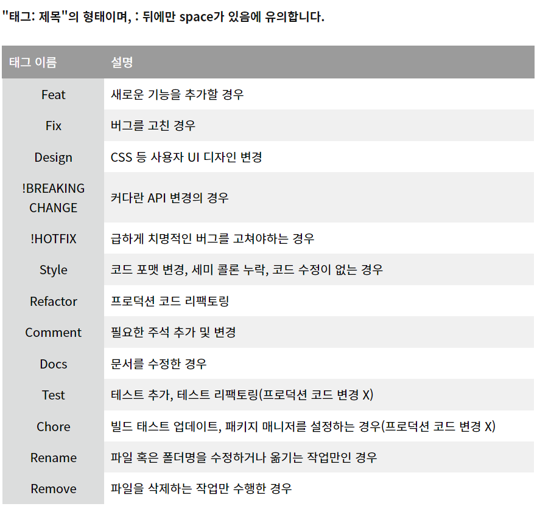

🚀 기능 요구 사항
-      
1. 1~9까지의 숫자 중 랜덤하게 3개의 숫자를 뽑아 수를 생성한다.
- 예외사항) 
- 랜덤으로 뽑은 3개의 숫자는 모두 달라야한다.

2. 사용자에게 수를 입력받는다.
- 예외사항) 
- 문자를 입력받으면 안된다.
- 입력받은 숫자가 3자리여야 한다.

3. 입력받은 숫자를 통해 게임을 진행한다.
- 볼, 스트라이크의 개수를 세서 반환한다.

4. 결과를 나타낸다.
- 볼 0개, 스트라이크 0개 : 낫싱
- 볼 n게. 스트라이크 n개 : n볼 n스트라이크
- 스트라이크 3개 : 3스트라이크
-> 정답 문구 출력/게임 종료

5. 게임 종료 후 게임을 더 진행할 건지 확인한다.
- 1 입력 : 위 기능 반복
- 2 입력 : 프로그램 종료

impression
-   
- 깃허브 컨벤션 참조용

- 1주차가 끝난 후 공통 피드백을 통해 기능 단위로 commit을 진행하고 git convention을 맞춰 commit 메시지를 작성해야한다는 피드백이 있었다.
- 1주차를 생각해보니 총 7문제를 각각 문제별로 하나씩 풀고 commit하는 방식을 사용했는데 이 방식은 잘못되었구나라는 것을 느꼈다.
- 2주차부터는 모든 기능 또는 메서드를 하나씩 구현할 때마다 commit을 해야겠다라고 생각했다.
- 처음에 시작할 때 굉장히 막막했다. 하지만 Application 클래스를 확인한 후 적절한 view, controller, service 등을 나눠 구현을 해야겠다고 생각했다.
- 코드를 하나의 클래스가 아닌 여러 클래스로 나눠서 작성을 해야했으며 이러한 패턴이 있는 것을 알았지만 충분한 학습을 하기 위해 구글링과 유튜브를 통해 학습하였다.
- 테코톡의 제리님의 MVC 패턴 영상을 참고하여 view를 만들어 시스템이 출력하는 부분을 모으자라고 생각했다.
- 크게 view, domain, service controller로 나누어 service에는 기능을 controller에는 application에 전달하기 위한 실제 동작들을 구현하고자 생각했지만 막상 시작을 하고 나니 domain 부분부터 막히기 시작했다.
- 결국 우아한테크코스 프리코스를 진행했던 선배들의 블로그와 깃허브를 참고하여 이번 프로젝트를 진행하게 되었다.
- kth990303님 블로그, API_Dev님 블로그, dongho108님의 깃허브 등을 참고하여 설계, 구조 등을 참고했었다.
- IllegalArgumentException을 처리해주는 부분이 애매하여 모든 부분에서 처리했고 이에 관한 부분은 좀 더 학습이 필요하다고 느꼈다.
- application을 동작했을 때 an illegal reflective access operation has occurred라는 문구가 나와 당황했지만 슬랙에서 비슷한 경험을 하는 다른 분들의 댓글을 통해 gradle을 수정하지 않았다.
- test를 작성하는 것이 매우 복잡했다.
- 오류가 날 수 있는 테스트 케이스를 하나 만든 후 IllegalArgumentException이 나는 지를 확인하는 방식으로 보통 진행했다.
- 처음 StringTest가 뭔지 몰라서 내가 test할 수 있는 NumberTest를 따로 만들어 이 곳에다 test를 진행했다.

- 추가로 private과 public 등 접근제어자에 관한 학습을 하였다.
- 이번 프로젝트는 개인이 하는 프로젝트이며 규모가 크지 않고 접근을 제어할 필요가 굳이 없어 public을 이용해 대부분 진행했다.
- 하지만 프로젝트는 보통 개인이 하는 경우가 거의 없으므로 접근 제어를 통해 관리를 해줘야 할 필요성을 느꼈다.
- 클래스 안에서만 사용하는 메서드들을 private 처리를 해주었다.

- 각각의 클래스는 130줄을 넘기지 않기 위해 관련 있는 것들끼리 클래스를 나눠서 코드를 작성하였다.
- 역시나 클래스명, 메서드명, 변수명 등을 설정하는 데 어려웠다. 길더라도 최대한 이해가 빠르게끔 변수 설정을 하였는데 이것 또한 고민이 많았다. 과연 길게 만드는 것이 더 좋은 것인지 하는 의문도 들었지만 직관적으로 알아볼 수 있게끔 작성하는 게 더 좋지 않을까라는 판단으로 이름들을 지었다.
- 실제로 볼, 스트라이크를 구하는 과정에서 일단 직접적으로 depth를 신경쓰지 않고 구현한 후 메서드화하여 depth를 줄이는 방식을 사용하니 코드가 훨씬 깔끔하고 직관적이게 되었다.
- 물론 단번에 메서드를 여러 개 나눠 바로 구현할 실력이 있으면 좋겠지만, 아직 그 수준까지 도달하지 못했으므로 계속해서 학습을 하고 다른 사람의 코드를 눈에 익히는 것이 필수적이다라고 느꼈다.

