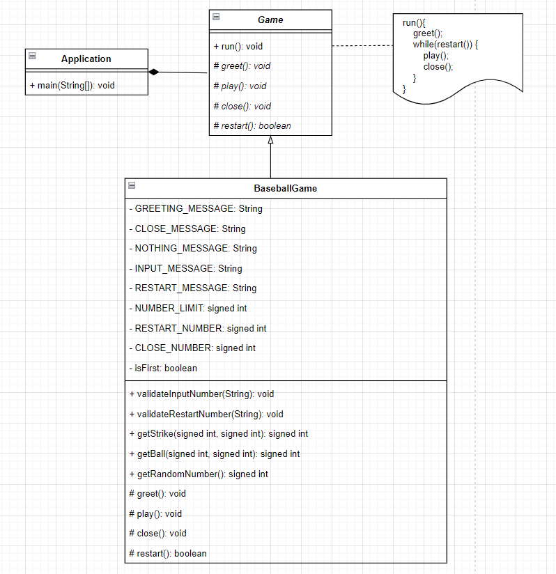

# 미션 - 숫자야구 기능 명세서(Specification)

## 1. 예외 처리

사용자가 잘못된 값을 입력할 경우 `IllegalArgumentException`을 발생시킨 후 애플리케이션은 종료되어야 한다.

- 정답은 1부터 9까지 서로 다른 수로 이루어진 3자리의 수이다.
- 사용자 입력은 서로 다른 3자리의 수이다.
- 게임이 끝난 경우 재시작/종료를 구분하는 1과 2 중 하나의 수이다.

## 2. High Level 디자인

> swimlane 을 이용해 작성

    

## 3. Low Level 디자인

> class diagram 을 이용해 작성

    

- `getStrike` : 스트라이크가 얼마나 있는지 판별하는 것은 야구게임의 책임이다.
- `getBall` : 볼이 얼마나 있는지 판별하는 것은 야구게임의 책임이다.
- `getRandomNumber` : 야구게임만의 특별한 난수를 만드는 책임은 야구게임이 가지고 있다.
- `validateInputNumber` : 입력값에 대한 요구사항은 야구게임이 정하기 때문에, 유효성검사에 대한 책임은 야구게임이 가지고 있다.
- `validateRestartNumber` : 재시작 입력에 대한 요구사항은 야구게임이 정하기 때문에, 유효성검사에 대한 책임은 야구게임이 가지고 있다.

## 4. 구현 리스트

### 형식

> [scope] : 구현 예정 사항을 작성한다.

### 리스트

- `Spec` : 기능 명세 작성
- `Game` : 추상 클래스 Game 생성
- `Game` : 오퍼레이션 시그니처 구현
- `Game` : 템플릿 메서드 구현
- `BaseballGame` : 콘크리트 클래스 BaseballGame 생성
- `BaseballGame` : 구현 예정 오퍼레이션 시그니처 생성
- `Application` : 템플릿 메서드 호출 코드 작성
- `BaseballGame` : 멤버 변수 생성
- `BaseballGame` : greet 메서드 구현
- `BaseballGame` : close 메서드 구현
- `BaseballGame` : restart 메서드 구현
- `BaseballGame` : getStrike 테스트코드 작성
- `BaseballGame` : getStrike 메서드 구현
- `BaseballGame` : getBall 테스트코드 작성
- `BaseballGame` : getBall 메서드 구현
- `BaseballGame` : getRandomNumber 테스트코드 작성
- `BaseballGame` : getRandomNumber 메서드 구현
- `BaseballGame` : validateInputNumber 테스트코드 작성
- `BaseballGame` : validateInputNumber 메서드 구현
- `BaseballGame` : validateRestartNumber 테스트코드 작성
- `BaseballGame` : validateRestartNumber 메서드 구현
- `BaseballGame` : play 메서드 구현

